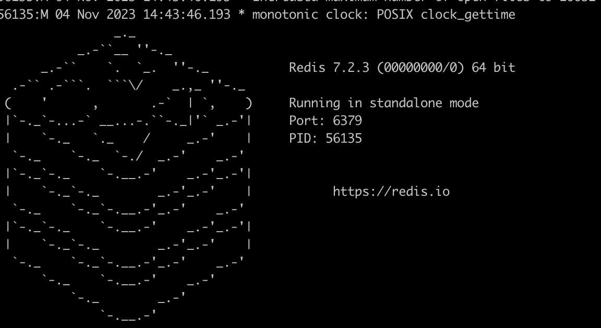
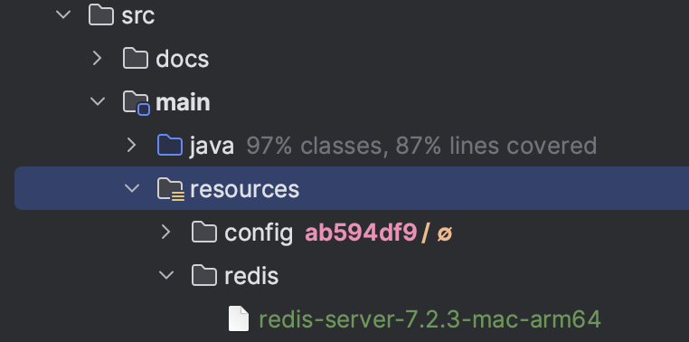
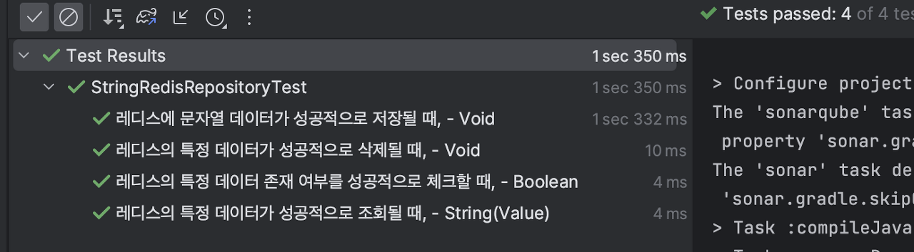

안녕하세요. 현재 데브코스 4기로 활동 중인 모아밤팀 서버 개발자 홍혁준입니다. 

이번 포스팅에서 Embedded Redis에 대해 이야기를 풀어내 보려고 합니다. 감사합니다.

---

## 배경

모아밤에서는 다음 요구사항을 위해 Redis 저장소를 활용하게 되었습니다.

-   사용자는 다른 사용자에게 12시간 마다 1회 콕 알림을 보낼 수 있다.
-   사용자는 자신이 속한 방의 인증타임에 알림이 울립니다.

개인적으로 프로젝트 코드를 누군가가 클론했을 때, 즉시 로컬 환경에서는 개발 및 테스트를 시작할 수 있어야 한다고 생각합니다. 때문에, 테스트 할 수 있는 환경 구성이 필요하게 되었고 Embedded Redis을 적용하게 되었습니다. 사용할 기술은 다음과 같습니다.

#### Spring Data Redis

-   Redis를 마치 JPA Repository 이용하듯 인터페이스를 제공하는 Spring Module 입니다.

#### Lettuce

-   Redis Java Client로 현재 Spring Data Redis에서 공식 지원하는 클라이언트입니다.
-   추가로 Jedis도 공식 지원하지만, 거의 업데이트 되지 않아서 Lettuce를 선택하게 되었습니다.

#### Embedded Redis

-   H2와 같은 내장 Redis 데몬입니다. 즉, 로컬 환경 Redis를 실행하지 않아도 됩니다.

---

## Embedded Redis 적용하기

**1) build.gradle 설정**

-   내장 Redis는 [it.ozimov](https://github.com/ozimov/embedded-redis) 외에도 [kstyrc](https://github.com/kstyrc/embedded-redis)가 있는데, kstyrc 오랫동안 업데이트가 없어서 kstyrc를 Fork해서 만들어진 it.ozimov 모듈을 사용하게 되었습니다.
-   it.ozimov는 최신 버전으로 0.7.3이 있습니다. 다만, 해당 버전은 [SLF4J가 여러번 바인딩되는 문제](https://github.com/ozimov/embedded-redis/pull/18)가 발생해서 0.7.2 버전을 사용하게 되었습니다. 또 다른 해결 방법으로는 컴파일 시 SLF4J를 제외하는 방법이 있기도 합니다.

```
// Redis
implementation 'org.springframework.boot:spring-boot-starter-data-redis'

// Embedded-Redis
implementation group: 'it.ozimov', name: 'embedded-redis', version: '0.7.2'

// 0.7.3 버전으로 할 때, SLF4J를 제외하는 방법
implementation ('it.ozimov:embedded-redis:0.7.3') { exclude group: "org.slf4j", module: "slf4j-simple" }
```

**2) Embedded Redis 시작 및 종료 설정**

-   @Profile로 로컬 환경일 때만, 실행되도록 합니다.
-   isRedisRunning() : 
-   findAvailablePort() : 

```
@Slf4j
@Profile("local")
@Configuration
public class EmbeddedRedisConfig {

    @Value("${spring.data.redis.port}")
    private int redisPort;

    private RedisServer redisServer;

    @PostConstruct
    public void startRedis() throws IOException {
        redisServer = new RedisServer(port);
        redisServer.start();
    }

    @PreDestroy
    public void stopRedis() {
        redisServer.stop();
    }
}
```

**3) 통합 테스트 환경 구성**

-   2단계까지만 설정 시, 여러 스프링 컨텍스트 실행할 때, EmbeddedReids 포트 충돌이 날 수 있습니다. 즉, 서로 다른 Property를 가진 테스트 코드가 있는 경우 충돌이 날 수 있습니다. 때문에, 아래와 같이 추가 설정이 필요합니다.
-   startRedis()에서 메모리 할당을 명시했습니다. 이를 안할 시, [윈도우 환경에서는 문제](https://github.com/kstyrc/embedded-redis/issues/77)가 발생합니다.
-   그 외 설명은 주석을 확인바랍니다.

```
// ...
public class EmbeddedRedisConfig {

    // ...
    
    /**
     * REDIS_SERVER_MAX_MEMORY : "maxmemory 128M"
     */
    @PostConstruct
    public void startRedis() {
        int port = isRedisRunning() ? findAvailablePort() : redisPort;
        redisServer = RedisServer.builder()
            .port(port)
            .setting(REDIS_SERVER_MAX_MEMORY)
            .build();

        redisServer.start();
    }

    @PreDestroy
    public void stopRedis() {
        if (redisServer != null) {
            redisServer.stop();
        }
    }

    /**
     * 현재 PC 서버에서 사용 가능한 포트 조회
     */
    public int findAvailablePort() {
        for (int port = 10000; port <= 65535; port++) {
            Process process = executeGrepProcessCommand(port);

            if (!isRunning(process)) {
                return port;
            }
        }

        throw new MoabamException(ErrorMessage.NOT_FOUND_AVAILABLE_PORT);
    }

    /**
     * Embedded Redis가 현재 실행 중인지 확인
     */
    private boolean isRedisRunning() {
        return isRunning(executeGrepProcessCommand(redisPort));
    }

    /**
     * 해당 Port를 사용 중인 프로세스를 확인하는 sh 실행
     */
    private Process executeGrepProcessCommand(int redisPort) {
        // netstat -nat : 시스템 네트워크 연결 상태 확인 명령어
        // grep LISTEN : 'LISTEN'이 포함된 줄 확인 명령어
        // grep %d : 앞서 주어진 출력 내용에서 포트번호가 포함된 줄 확인 명령어
        String command = String.format("netstat -nat | grep LISTEN | grep %d", redisPort);
        
        //  '/bin/sh'에서 '-c' 옵션과 함께 위에서 만든 command를 실행하는 명령을 배열 형태로 구성
        String[] shell = {"/bin/sh", "-c", command};

        try {
            return Runtime.getRuntime().exec(shell);
        } catch (IOException e) {
            throw new MoabamException(e.getMessage());
        }
    }

    /**
     * 해당 Process가 현재 실행 중인지 확인
     */
    private boolean isRunning(Process process) {
        String line;
        StringBuilder pidInfo = new StringBuilder();

        try (BufferedReader input = new BufferedReader(new InputStreamReader(process.getInputStream()))) {
            while ((line = input.readLine()) != null) {
                pidInfo.append(line);
            }
        } catch (Exception e) {
            throw new MoabamException(ErrorMessage.ERROR_EXECUTING_EMBEDDED_REDIS);
        }

        return StringUtils.hasText(pidInfo.toString());
    }
}
```

---

## 트러블 슈팅 - M1 ARM

### 문제 상황

테스트 환경에서 Ebmedded Redis가 동작하게 구성했는데, M1에서는 Database가 실행되지 않는 현상이 발생했습니다.

---

### 원인

Embedded Redis 라이브러리에서 mac\_arm64 용 바이너리가 준비되어 있지 않고 소스 코드에도 MAC\_OS\_X\_arm64가 없는 것이 원인입니다.

---

### 해결 방법

**1) brew를 통한 wget 설치**

```
brew install wget
```

**2) 소스 코드 다운로드 및 컴파일**

```
// 소스 코드 다운로드
wget https://download.redis.io/releases/redis-7.2.3.tar.gz

// 압축 해제
tar xzf redis-7.2.3.tar.gz 

// 디렉토리 이동
cd redis-7.2.3

// 파일 링크 및 설치 등
make
```

**3) 바이너리 파일 실행 여부 확인**

```
src/redis-server
```



**4) 바이너리 파일을 프로젝트에 추가**



**5) EmbeddedRedisConfig에 설정 추가**

```
// ...
public class EmbeddedRedisConfig {
    // ...

    @PostConstruct
    public void startRedis() {
        int port = isRedisRunning() ? findAvailablePort() : redisPort;

        if (isArmMac()) {
            redisServer = new RedisServer(getRedisFileForArcMac(), port);
        } else {
            redisServer = RedisServer.builder()
                .port(port)
                .setting(REDIS_SERVER_MAX_MEMORY)
                .build();
        }

        try {
            redisServer.start();
        } catch (Exception e) {
            throw new MoabamException(e.getMessage());
        }
    }

    /**
     * 현재 시스템이 ARM 아키텍처를 사용하는 MAC인지 확인
     * System.getProperty("os.arch") : JVM이 실행되는 시스템 아키텍처 반환
     * System.getProperty("os.name") : 시스템 이름 반환
     */
    private boolean isArmMac() {
        return Objects.equals(System.getProperty("os.arch"), "aarch64")
            && Objects.equals(System.getProperty("os.name"), "Mac OS X");
	}
    
    /**
     * ARM 아키텍처를 사용하는 Mac에서 실행할 수 있는 Redis 바이너리 파일을 반환
     */
    private File getRedisFileForArcMac() {
        try {
            return new ClassPathResource("binary/redis/redis-server-arm64").getFile();
        } catch (Exception e) {
            throw new MoabamException(e.getMessage());
        }
    }
}
```

**실행 결과**



---

## Reference

-   [Redis 공식 문서](https://redis.io/docs/reference/arm/)
-   [기억보단 기록을 - Spring Boot Data Redis 로컬/통합 테스트 환경 구축](https://jojoldu.tistory.com/297)
-   [ARM MAC M1에서 Embedded Redis 적용](https://velog.io/@hakjong/ARM-Mac-M1-%EC%97%90%EC%84%9C-embedded-redis-%EC%82%AC%EC%9A%A9)

```toc
```
