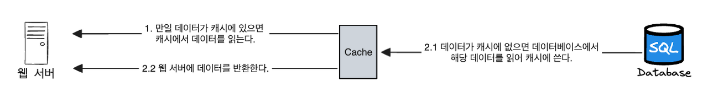

안녕하세요. 백엔드 데브코스 4기를 무사히 수료한 모아밤팀 서버 개발자 홍혁준입니다.  
이번 포스팅에서 **Caching**에 대해 이야기를 풀어내 보려고 합니다. 감사합니다.

---

## 개요

#### 문제

현재 모아밤 서비스의 문제점은 
[Moabam Tech - 실시간 선착순 쿠폰 이벤트 도입기](https://hongdosan.tistory.com/376) 포스팅을 보면 알 수 있듯 
대기열 등록 및 쿠폰 발급 부분에서 DB에 동일한 요청을 계속해서 보내고 있습니다. 
즉 불필요한 쿼리가 발생하고 있습니다.

#### 원인

사용자들이 선착순 쿠폰 발급을 위해 쿠폰 발급 요청을 하기 때문에, 
단기간에 동일한 요청이 여러번 발생합니다. 또한 스케줄러로 인해 1초마다 동일한 쿼리가 발생합니다.

#### 해결

현재 모아밤 서비스는 쿠폰 정보 변경 가능성이 없다고 봐도 무방합니다. 
또한 동일한 요청을 보내고 별도 연산없이 동일한 응답값을 보내고 있습니다. 
따라서 **캐싱 기능**을 통해 성능을 개선할 수 있을 것이라 판단했습니다.

---

## 캐시란 무엇일까?

캐시는 **값비싼 연산 결과 또는 자주 참조되는 데이터를 메모리 안에 두고, 
뒤이은 요청이 보다 빨리 처리될 수 있도록 하는 저장소**입니다. 
애플리케이션은 데이터베이스를 얼마나 자주 호출하냐에 크게 좌우되는데, 
현재 모아밤은 쿠폰 데이터를 가져오기 한 번 이상의 데이터베이스 호출이 단기간 혹은 주기적으로 발생합니다. 
캐시는 이 문제를 해결할 수 있습니다. 글로만 보면 이해가 안가니, 그림을 보면서 캐시 흐름을 이해해봅시다.

---

### 그림으로 이해하기



위 그림처럼 별도의 캐시 계층을 두어서 데이터를 잠시 보관한다면 
성능이 개선될 뿐만 아니라 데이터베이스의 부하를 줄일 수 있게 됩니다.

---

## 어떤 점을 고려해야 할까?

캐시를 사용하기 위해서 여러 고민사항이 있는데, 모아밤이 현재 큰 서비스는 아니기 때문에, 
아래에 정리한 3가지를 고민해봤습니다.

<br/>

### 1. 캐시에 저장할 쿠폰 정보 데이터는 어떻게 만료할 것인가?

만료 정책이 없거나 너무 길면 캐시에 쿠폰 정보가 계속 남게 되어 일관성 문제가 발생합니다. 
이로 인해 쿠폰 발급에 문제가 발생할 것입니다. 또한 만료 기한이 너무 짧으면 데이터베이스를 
자주 읽기 때문에 곤란합니다.

<br/>

### 2. 장애에는 어떻게 대처할 것인가?

사실 캐시 서버를 한 대만 두는 경우 해당 서버는 단일 장애 지점(SPOF)이 되어버릴 가능성이
있습니다.

<br/>

### 3. Local Cache와 Global Cache 중 어떤 것을 선택할 것인가?

**로컬 캐시는 각 캐시 서버를 두고 저장하는 전략**으로 로컬 서버의 리소스(Memory, Disk)를 
사용해 캐싱을 처리합니다. 때문에 속도는 빠르지만, 다른 서버의 캐시를 참조하기가 어렵습니다. 
반대로 **글로벌 캐시는 별도의 캐시 서버를 두는 전략**으로 Redis 혹은 Memcached 등을 
사용해 캐싱을 처리합니다. 때문에, 서버 간 데이터 공유가 쉽지만 네트워크 트래픽을 사용하기 때문에 
로컬 캐시보단 속도가 느립니다.

---

## 고려사항에 대한 모아밤의 선택

### 1. 캐시에 저장할 쿠폰 정보 데이터는 어떻게 만료할 것인가?

모아밤 서비스는 00시에 단 하나의 쿠폰 이벤트가 발생합니다. 즉, 
캐시 데이터는 00시가 되면 그 즉시 만료하는 정책으로 가면 될 것 같습니다. 예
를 들어, 최초 요청이 들어왔을 때, 00시에서 해당 요청 시간을 뺀 값으로 만료시간을 
정하면 될 것 같습니다.

<br/>

### 2. 장애에는 어떻게 대처할 것인가?

현재 모아밤의 자원은 한정적입니다. 어쩔 수 없이 SPOF를 감안하고 캐시 서버는 한 대로 진
행해야 할 것 같습니다.

<br/>

### 3. Local Cache와 Global Cache 중 어떤 것을 선택할 것인가?

고민 끝에, 모아밤에서는 Global Cache를 선택하게 되었습니다. 여러가지 이유가 있는데,
사실 현재 상황에선 Local Cache 전략을 사용하는 게 더 좋습니다. 다만 이미 Redis 저
장소를 사용하고 있는 점, 추후 서버가 2대 이상이 되거나, 모아밤의 쿠폰 이벤트 정책이 변경되
었을 때, 코드 변경이 크게 일어난다는 점을 고려해서 Global Cache를 선택하게 되었습니다.

---

## Redis로 캐싱 구현하기

### 캐싱에 필요한 설정 및 만료 정책 코드

-   redisCacheConfiguration() : 원하는 TTL과 직렬화 전략을 설정했습니다.
-   getTtl() : TTL을 반환합니다. 이는 00시 기준으로 요청 시각을 뺀 값입니다.
-   objectMapper() : Jackson2는 LocalDate 타입을 인식하지 못하기 때문에, 그에 따른 에러 방지 설정

``` java
@EnableCaching
@Configuration
@RequiredArgsConstructor
public class CacheConfig {

    ...

	@Bean
	public RedisCacheConfiguration redisCacheConfiguration() {
		var strSerializePair = SerializationPair.fromSerializer(new StringRedisSerializer());
		var objSerializePair = SerializationPair.fromSerializer(new GenericJackson2JsonRedisSerializer(objectMapper()));

		return RedisCacheConfiguration.defaultCacheConfig()
			.entryTtl(getTtl())
			.serializeKeysWith(strSerializePair)
			.serializeValuesWith(objSerializePair);
	}

	private Duration getTtl() {
		LocalTime now = clockHolder.time();
		LocalTime end = clockHolder.endOfDay();

		return Duration.between(now, end);
	}

	private ObjectMapper objectMapper() {
		PolymorphicTypeValidator polymorphicTypeValidator = BasicPolymorphicTypeValidator.builder()
			.allowIfSubType(Object.class)
			.build();

		return JsonMapper.builder()
			.polymorphicTypeValidator(polymorphicTypeValidator)
			.disable(SerializationFeature.WRITE_DATES_AS_TIMESTAMPS)
			.addModule(new JavaTimeModule())
			.activateDefaultTyping(polymorphicTypeValidator, ObjectMapper.DefaultTyping.NON_FINAL)
			.build();
	}
}
```

### 캐시 서비스 코드

-   getByNameAndStartAt(...) : 쿠폰 발급 요청 시, 요청된 쿠폰 정보 캐싱
-   getByStartAt(...) : 쿠폰 발급 대기열 처리 시, 해당 쿠폰 정보 캐싱

``` java
@Service
@RequiredArgsConstructor
@CacheConfig(cacheNames = "coupons")
public class CouponCacheService {

	private final CouponRepository couponRepository;

	@Cacheable(key = "#couponName + #now")
	public Coupon getByNameAndStartAt(String couponName, LocalDate now) {
		return couponRepository.findByNameAndStartAt(couponName, now)
			.orElseThrow(() -> new NotFoundException(ErrorMessage.INVALID_COUPON_PERIOD));
	}

	@Cacheable(key = "#now")
	public Optional<Coupon> getByStartAt(LocalDate now) {
		return couponRepository.findByStartAt(now);
	}
}
```

---

## 단일 장애점 (SPOF; Single Point Of Failure)

#### [상황]

위 Redis 캐싱 서버 구축으로 `실시간 선착순 쿠폰 이벤트 도입기`의 문제점은 해결했지만, 캐시 서버 장애 시, 서비스 장애로 이어집니다. 때문에, 캐시 서버 장애가 발생하면 데이터베이스를 직접 조회하는 방안이 있습니다. 하지만 이 해결 방안도 결국 데이터베이스 부하가 생기기 때문에, 데이터베이스 서버 장애로 이어질 수 있습니다.

#### [해결]

지금 당장 생각해본 방법으론 로컬 캐시를 추가하여, Redis 캐시 장애가 발생 시, 로컬 캐시를 접근하도록 하여 해결하면 될 것 같습니다.

---

긴 글 읽어주셔서 감사합니다. 이상으로 포스팅은 여기서 마치고 단일 장애 지점 해결 방안의 자세한 내용은 모아밤의 `캐시 서버로 인한 단일 장애 지점 - (작성중)` 포스팅에서 이어나가겠습니다. 😁

---

## Reference

-   [Spring Expression Language Guide - Baeldung](https://www.baeldung.com/spring-expression-language)
-   [Spring Boot Cache with Redis - Baeldung](https://www.baeldung.com/spring-boot-redis-cache)
-   [Redis Cache - 공식 문서](https://docs.spring.io/spring-data-redis/reference/redis/redis-cache.html)
-   [JCache Annotations - 공식 문서](https://docs.spring.io/spring-framework/reference/integration/cache/jsr-107.html)
-   가상 면접 사례로 배우는 대규모 시스템 설계 기초 - 알렉스 쉬 지음, 이병준 옮김

```toc
```
