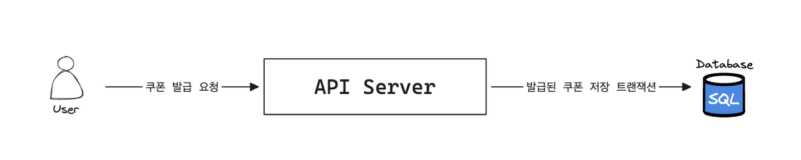
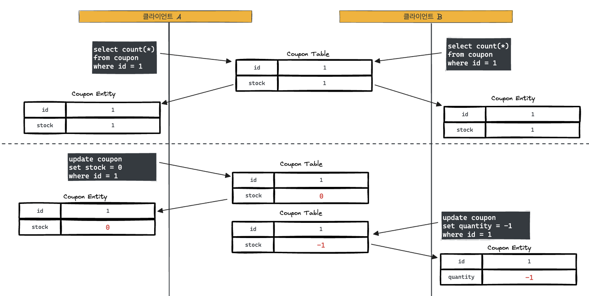
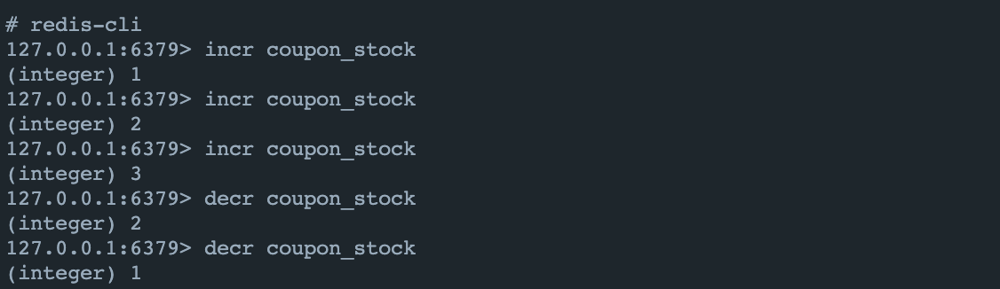
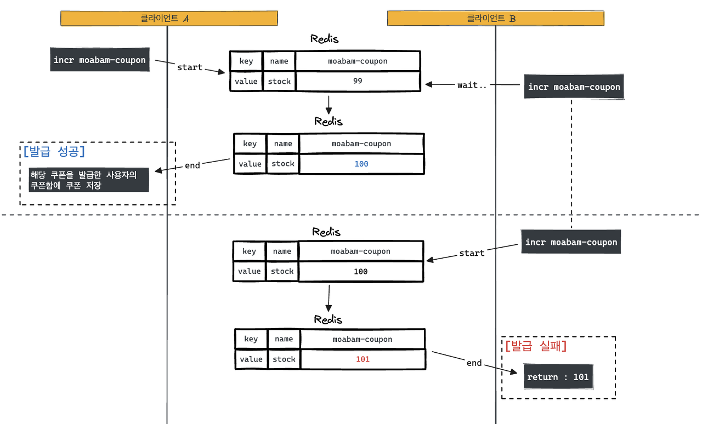
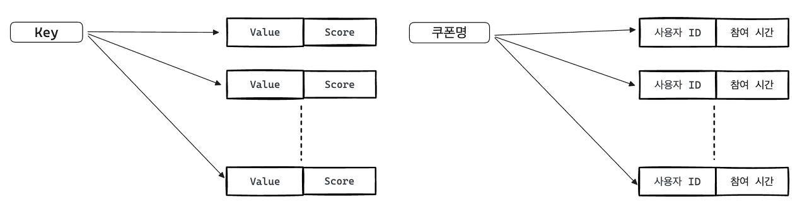
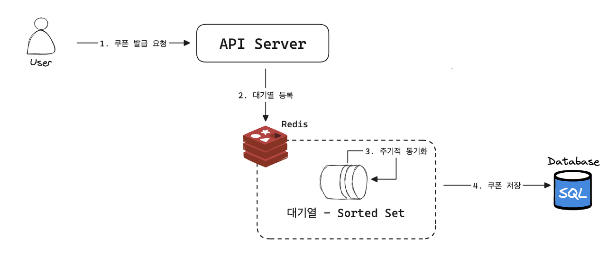

안녕하세요. 현재 데브코스 4기로 활동 중인 모아밤팀 서버 개발자 홍혁준입니다.

이번 포스팅에서 **실시간 선착순 시스템**에 대해 이야기를 풀어내 보려고 합니다. 감사합니다.

---

## 배경

저희 모아밤 서비스는 사용자들을 위해 쿠폰 이벤트를 도입하게 되었습니다. 
현재 생각 중인 쿠폰은 선착순으로 진행하는 이벤트로 사용자들이 다양한 종류의 N개 쿠폰을 선착순으로 지급 받도록 할 계획입니다.

선착순 쿠폰 발급 이벤트는 짧은 시간에 많은 트래픽이 발생합니다. 
중요한 점은 서버가 다운되지 않고 수량 제한에 맞춰 정확하게 쿠폰이 발급되어야 합니다. 
이런 사항들을 모아밤에서는 어떻게 해결했는지 살펴봅시다.

### 요구사항

-   사용자들은 정해진 재고에 따라 선착순으로 쿠폰을 발급 받을 수 있다.
-   동일한 이벤트에서 동일 사용자가 쿠폰을 중복하여 발급 받을 수 없다.
-   쿠폰은 발급 후 쿠폰함 혹은 결제창에서 1회 사용 가능하다.

### 고민사항

-   N번의 선착순일 때, 정확하게 N번 발급해줄 수 있어야 합니다.
-   쿠폰 발급 요청을 여러번 하는 경우 최초 요청을 선착순 발급 기준으로 1회만 받습니다.
-   짧은 시간 내에 발생하는 높은 트래픽을 감당해야 합니다.

---

## 모아밤의 쿠폰 발급 아키텍처



쿠폰 발급을 위한 흐름을 살펴봅시다.

1.  사용자가 쿠폰 발급 요청을 서버로 보냅니다.
2.  서버에서는 요청을 받아 쿠폰 발급 로직을 처리합니다.
3.  발급된 쿠폰이 데이터베이스에 저장됩니다.

이처럼 쿠폰 발급 요청은 매우 간단합니다. 하지만 쿠폰 발급 요청이 많아지고 트래픽이 많아진다면, 
그만큼 동시에 들어오는 요청이 많을 텐데 Race Condition 문제는 어떻게 해결해야 할까요? 
또 Race Condition 문제가 발생하지 않더라도 트래픽이 API 처리량을 넘어간다면 장애가 발생할텐데, 
이런 문제들이 어떤 상황에 발생하는 것이고 어떤 해결방법이 있고 모아밤에서는 어떻게 해결했을까요? 
계속해서 살펴봅시다.

<br/>

### Race Condition 살펴보기

> Race Condition (경쟁 상태) : 둘 이상의 입력 또는 조작의 타이밍, 순서 등이 결과값에 영향을 줄 수 있는 상태

모아밤 서비스에서 사용자들에게 선착순으로 100개의 쿠폰을 지급한다고 가정해봅시다.

개발 관점으로 보면 여러명의 사용자가 쿠폰을 동시에 발급받아서 쿠키 재고를 감소시킬 수 있게 됩니다. 
즉 쿠폰(공유 자원)에 N명의 사용자가 접근하여 읽거나 쓰려고 하는 Race Condition이 발생할 수 있게 됩니다.

<br/>

**[그림으로 이해하기]**

단, 한명의 사용자에게만 쿠폰을 지급하는 이벤트가 있다고 가정해봅시다. 이해를 위해 재고 감소 과정을 표현했습니다.



위 그림처럼 클라이언트 A가 쿠폰을 가져옵니다. 
하지만 클라이언트 B도 클라이언트 A가 쿠폰을 발급받기 전에 쿠폰을 가져오게 되고 클라이언트 A와 B 모두 가져온 
쿠폰 재고는 1개가 있습니다. 때문에, 결국 클라이언트 A와 B가 쿠폰을 발급받게 되고 쿠폰 재고는 -1개가 됩니다. 
이러한 상황을 Race Condition이라고 할 수 있습니다.

이처럼 Race Condition은 두 개 이상의 스레드가 공유 데이터에 접근할 때 발생하는 문제이므로 
싱글 스레드로 작업을 한다면 레이드 컨디션은 일어나지 않습니다. 
하지만 싱글 스레드 작업은 먼저 요청한 사용자가 쿠폰이 발급되기까지 대기하다가 다른 사람들이 쿠폰 발급이 
가능해지기 때문에 성능이 좋지 못합니다. 그렇다면 어떻게 해결해야 할까요?

---

## 문제 해결 - Java **(X)**

### 자바의 synchronized 키워드 이용하기

자바의 synchronized는 멀티 스레드 환경에서 단 하나의 스레드만이 특정 코드 블럭을 실행하도록 보장하는 
역할을 합니다. 그래서 해결할 수 있을 거라 생각할 수 있습니다. 하지만 이는 서버가 여러 대가 되는 순간 다시 
Race Condition이 발생하게 되어 적절하지 않습니다.

---

## 문제 해결 - Lock **(X)**

### MySQL Lock과 Redis를 활용한 분산락을 이용하기

[\[🌐 동시성 이슈 보러 가기\]](https://hongdosan.tistory.com/373)

MySQL Lock과 Redis Lock을 이용해도 충분히 해결할 수 있습니다. 하지만 다시 생각해봅시다. 
우리는 선착순으로 쿠폰을 발급해주기 위해 Coupon Table에서 해당 쿠폰의 갯수를 먼저 가져와야 합니다. 
그리고 나서 쿠폰 재고를 감소함과 동시에 한 사용자의 지갑에 쿠폰을 생성해줘야 합니다. 
즉 **이 모든 과정에 락을 걸어야 하는 것**입니다.

이렇게 된다면 락을 거는 구간이 길어져서 성능에 불이익이 있을 수밖에 없습니다. 
예를 들어, n초가 걸린다면 n초만큼 계속해서 밀리게 되고 사용자는 밀린 시간만큼 기다려야 합니다. 
따라서 해당 방법도 적절하지 않을 것 같습니다.

---

## 문제 해결 - Redis INCR **(X)**

### Redis의 INCR 혹은 DECR 명령어

> INCR 명령어 : 키에 대한 값을 1씩 증가시키는 명령어로 성능도 매우 빠릅니다.  
> DECR 명령어 : 키에 대한 값을 1씩 감소시키는 명령어로 성능도 매우 빠릅니다.

Redis는 싱글 스레드이기 때문에, Race Condition도 해결할 수 있습니다. 
또한 저희의 핵심은 쿠폰 개수이므로 쿠폰 개수 정합성만 관리하면 충분합니다. 
때문에 **성능도 매우 빠른** **Redis의 DECR 명령어를 활용해 해결하는 것은 매우 적절**합니다.

<br/>

**[redis-cli 실습]**



위 이미지처럼 incr 명령어로 값을 1씩 증가시키고 decr 명령어로 값이 1씩 감소하는 것을 살펴볼 수 있습니다. 
이처럼 해당 명령어로 발급된 쿠폰 개수를 제어할 수 있게 되는 것입니다. 
즉, 쿠폰 발급전에 쿠폰 재고를 1 증가시키고 반환되는 값이 100보다 크면 쿠폰 발급을 멈추는 로직을 작성할 수 있습니다.

### 흐름



Redis는 싱글-스레드 기반으로 동작하기 때문에, 
위 흐름처럼 클라이언트 A가 INCR 명령어를 실행했다면 클라이언트 B는 해당 명령어 작업이 종료될 때까지 기다렸다가 INCR 명령어를 실행하게 됩니다. 
이처럼 **모든 스레드에서는 언제나 최신값을 가져갈 수 있게 됩니다.**

### 문제점

Redis의 INCR을 사용해, 선착순으로 쿠폰을 발급할 수 있게 하였습니다. 
하지만 이 방식은 높은 트래픽이 발생했을 때, 발생하는 문제점들을 해결하지 못했습니다. 
예를 들어, 이는 선착순 쿠폰 재고가 10_000개이고 선착순 쿠폰 발급 가능 시각이 되어서 10_000명의 사용자가 동시에 선착순 쿠폰 요청을 보냈다고 가정해봅시다. 
이 경우 **10_000개의 쿠폰 저장 쿼리**가 동시에 발생합니다. 이로 인해 데이터베이스에 설정된 1분에 가능한 최대 INSERT 수가 100명이라면 모든 쿼리가 날라가는데, 총 100분이 걸리게 됩니다. 
최악의 경우 데이터베이스의 타임아웃보다 지연시간이 길어져서 쿠폰 저장이 되지 않는 이슈도 발생하게 됩니다.

### 해결 방법

해결 방법으로는 여러가지가 있을 텐데, 그 중 대표적으로 메시징 큐에 담아 처리하는 방법이 있습니다. 
메시징 큐에 담아 처리하는 방법으로는 Kafka와 RabbitMQ를 사용하면 해결이 가능할 것입니다. 
하지만 [FCM Token 도입기](https://hongdosan.tistory.com/374) 포스팅 에서도 말했듯 초기 자원이 
한정적이라 서버 비용 추가 발생 시, 감당이 힘들다는 문제점과 초기 프로젝트임만큼 오버 엔지니어링입니다. 
또한 러닝커브가 높고 현재 사용되는 기술에 있어서 이해와 공부가 먼저라고 생각하여 해당 방법은 고려 대상에서 제외되었습니다.

---

## 문제 해결 - Redis Queue System **(O)**

앞서 포스팅에 적었던 문제 해결 방식들은 모두 적절하지 않다고 판단했습니다. 
따라서 "쿠폰 발급 요청에 대한 대기열을 만들어서 해결하자."란 결론을 내리게 되었습니다.

### 왜 Redis를 선택했을까?

대기열 저장소 선택에 있어서 고려사항은 고성능 처리 기능을 제공해야 해서 Redis를 고려하게 되었습니다. 
또한 저희 모아밤의 한정적인 자원에서 이미 Redis 사용을 기획에 포함시켰기 때문에, Redis 선택은 매우 
적합하다고 생각했습니다. 기술적인 면에서도 Redis는 아래와 같은 근거로 적절하다고 판단했습니다.

-   Redis는 이미 많은 서비스에서 사용되는 검증된 저장소입니다.
-   Redis는 I/O이 빠른 In-memory 데이터베이스입니다.
-   다양한 자료구조 지원으로 요구사항을 쉽게 해결 가능합니다.

### Redis의 어떤 명령어와 자료구조를 선택할까?

**[Redis KEYS 명령어] - X**

KEYS 명령어는 Full-Scan을 합니다. 그리고 시간복잡도가 O(n)이기 때문에, 
데이터가 많을 수록 성능이 떨어질 수밖에 없습니다. 심지어 Redis는 싱글-스레드이기 때문에 명령어 수행 시 
다른 명령어들은 블락되고 그만큼 지연되어 적절하지 않다고 판단했습니다.

<br/>

**[대기열 Redis의 List 자료구조] - X**

대기열을 추가하는데 List의 RPUSH와 대기열에서 대상을 가져오는 데 LPOP을 사용할 수 있습니다. 
두 명령어는 O(1)의 시간복잡도로 사용할 수 있습니다. 하지만 문제점이 있습니다. 
List 자료구조의 특정값의 순서를 찾을 수 있는 LPOS 명령어는 순차탐색이 필요하여 O(n)의 시간복잡도가 소요됩니다. 
또한 동일한 사용자가 쿠폰 발급 요청을 했을 때, List 자료구조를 사용하면 새로운 데이터가 계속되어 추가됩니다. 따라서 적절하지 않다고 판단하였습니다.

<br/>

**[대기열 - Redis의 Sorted Set 자료구조] - O**

Sorted Set은 특정 스코어를 기반으로 정렬하여 스코어로 TimeStamp를 사용할 수 있습니다.
또한 대기열을 추가하고 가져오는데 ZADD 명령어와 ZRANGE 명령어를 사용할 수 있습니다. 
두 명령어의 시간복잡도는 O(log(n))이기 List보다는 느리지만, 이 정도면 충분하다고 생각했습니다.

추가적으로 Sorted Set 자료구조에서는 Sorted Set은 ZADD NX 명령어 사용 시, 
데이터가 중복되지 않아 중복 쿠폰 발급 요청이 들어와도 최초 요청 기준으로 대기열을 관리할 수 있습니다. 
이러한 이유로 Sorted Set은 요구사항들을 간단하고 준수한 성능으로 만족시킬 수 있을 거라 판단하여 선택하게 되었습니다.

---

## Redis Sorted Set으로 선착순 쿠폰 발급 시스템 구현하기

위와 같은 다양한 해결방법을 고민하다가 모아밤에서는 결국 Redis에서 제공하는 Sorted Set을 활용하게 되었습니다. 
Sorted Set을 활용해 모든 요청이 바로 Database에 바로 부하가 가지 않고 순서대로 일정 범위만큼씩 처리하도록 구성했습니다.

### 모아밤에서의 Sorted Set 구조



Sorted Set은 하나의 Key에 여러 Value와 Score를 가지고 있으며 중복되지 않는 Value가 Score 순으로 데이터를 
정렬합니다. 만약 Score가 같으면 Value로 정렬됩니다.

모아밤에서는 쿠폰명이 유니크한 값이기 때문에, Sorted Set의 Key로 쿠폰명으로 하였고 Value를 사용자 
ID으로 선정했습니다. 마지막으로 Score는 참여 순서로 정렬하기 위해 쿠폰 발급 요청 시간을 유닉스타임(m/s) 값으로 
선정했습니다.

### 모아밤 쿠폰 발급 흐름

**이해를 위해 100명에게 지급하는 선착순 쿠폰이 있고 1000명이 동시에 쿠폰을 요청했다고 가정해봅시다.**



1.  1000명의 사용자가 동시에 쿠폰 발급 요청을 보냅니다.
2.  서버는 해당 요청을 바로 처리하지 않고 대기열의 크기가 100보다 작다면 계속해서 대기열에 등록합니다.
3.  대기열이 크기가 100과 같거나 크다면 해당 사용자들은 대기열에 등록하지 않습니다.
4.  서버는 스케쥴러를 통해 정해진 주기마다 대기열에 등록된 사용자 중 10명씩 쿠폰 발급 처리를 진행합니다.
5.  서버는 선착순 이벤트가 종료되기 전까지 2번부터 다시 반복합니다.

### 모아밤 대기열 등록 코드

-   findByNameAndStartAt(...) : 요청이 들어오면 발급 가능한 쿠폰이 있는지 조회합니다.
-   sizeQueue(...) : 시간복잡도가 O(1)인 Redis의 [ZCARD](https://redis.io/commands/zcard/) 명령으로 대기열 사이즈를 조회합니다.
-   sendCouponIssueResult(...) : 선착순 가능 인원보다 대기열 사이즈가 같다면 비동기로 발급 실패 알림을 보냅니다.
-   addIfAbsentQueue(...) : 시간복잡도가 O(log(n))인 Redis의 [ZADD NX](https://redis.io/commands/zadd/) 명령으로 대기열에 등록합니다.

``` java
public void registerQueue(String couponName, Long memberId) {
    double registerTime = System.currentTimeMillis();
    validateRegisterQueue(couponName, memberId);
    couponManageRepository.addIfAbsentQueue(couponName, memberId, registerTime);
}
    
private void validateRegisterQueue(String couponName, Long memberId) {
    LocalDate now = clockHolder.date();
    Coupon coupon = couponRepository.findByNameAndStartAt(couponName, now)
        .orElseThrow(() -> new BadRequestException(ErrorMessage.INVALID_COUPON_PERIOD));

    int maxCount = coupon.getMaxCount();
    int sizeQueue = couponManageRepository.sizeQueue(couponName);

    if (maxCount == sizeQueue) {
        notificationService.sendCouponIssueResult(memberId, couponName, FAIL_ISSUE_BODY);
        throw new BadRequestException(ErrorMessage.INVALID_COUPON_STOCK_END);
    }
}
```

### 모아밤 쿠폰 발급 코드

-   findByStartAt(...) : 스케줄러를 통해 1초마다 발급 가능한 쿠폰이 있는 지 체크합니다.

``` java
@Scheduled(fixedDelay = 1000)
public void issue() {
    LocalDate now = clockHolder.date();
    Optional<Coupon> optionalCoupon = couponRepository.findByStartAt(now);

    if (optionalCoupon.isEmpty()) {
        return;
    }
    
    ...
}
```

- getCount(...) : 시간복잡도가 O(1)인 Redis의 [GET](https://redis.io/commands/get/) 명령을 통해 현재 발급 갯수를 조회하고 선착순 가능 
인원과 비교하여 발급이 가능한지 체크합니다.

``` java
@Scheduled(fixedDelay = 1000)
public void issue() {
    ...
    
    int maxCount = coupon.getMaxCount();
    int currentCount = couponManageRepository.getCount(couponName);

    if (maxCount <= currentCount) {
        return;
    }
    
    ...
}
```

- rangeQueue(...) : 시간복잡도가 O(log(n) + m)인 Redis의 [ZRANGE](https://redis.io/commands/zrange/) 명령을 통해 대기열에서 
10명을 조회 후 쿠폰 발급을 진행합니다.

``` java
@Scheduled(fixedDelay = 1000)
public void issue() {

    ...
    
    Set<Long> membersId = couponManageRepository.rangeQueue(couponName, currentCount, currentCount + ISSUE_SIZE);
    
    for (Long memberId : membersId) {
        couponWalletRepository.save(CouponWallet.create(memberId, coupon));
        notificationService.sendCouponIssueResult(memberId, couponName, SUCCESS_ISSUE_BODY);
    }
    
    ...
}
```

- increase(...) : 시간복잡도가 O(1)인 Redis의 [INCRBY](https://redis.io/commands/incrby/) 
명령어를 통해 발급 횟수만큼 현재 발급 갯수를 증가시켜줍니다.

``` java
@Scheduled(fixedDelay = 1000)
public void issue() {
    ...
    
    couponManageRepository.increase(couponName, membersId.size());
}
```

<br/>

### 문제점

**[상황]**

코드를 보면, 대기열 등록에서와 쿠폰 발급에서 아래 명령을 통해 DB에 동일한 요청을 계속해서 보내고 있습니다. 
즉 불필요한 쿼리가 발생하고 최악의 경우 성능이 저하됩니다.

``` java
// 대기열 등록의 동일한 요청
Coupon coupon = couponRepository.findByNameAndStartAt(couponName, now)
    .orElseThrow(() -> new BadRequestException(ErrorMessage.INVALID_COUPON_PERIOD));
    
// 쿠폰 발급의 동일한 요청
Optional<Coupon> optionalCoupon = couponRepository.findByStartAt(now);
```

**[원인]**

-   대기열 등록 : 사용자들이 쿠폰 발급을 위해 동일한 요청이 단기간에 날라옵니다.
-   쿠폰 발급 : 스케줄러로 인해 1초마다 동일한 쿼리가 계속 발생합니다.

**[해결]**

현재 쿠폰은 변경 가능성이 없다고 봐도 무방합니다. 또한 동일한 요청을 보내고 별도의 연산 수행없이 동일한 
응답값을 받습니다. 따라서 Redis의 Cache 기능을 활용해 성능을 개선할 수 있을 것이라 판단했습니다.

긴 글 읽어주셔서 감사합니다. 이상으로 포스팅은 여기서 마치고 Redis Cache에 대한 자세한 내용은 모아밤의 **\[Redis Cache 기능 도입기\]** 포스팅에서 이어나가겠습니다. 😁

---

## Reference

-   [동시성 이슈 해결하기 - 홍도산](https://hongdosan.tistory.com/entry/%EB%B2%A1%EC%97%94%EB%93%9C-%EB%8D%B0%EB%B8%8C%EC%BD%94%EC%8A%A4-TIL-%EB%8F%99%EC%8B%9C%EC%84%B1-%EC%9D%B4%EC%8A%88-%ED%95%B4%EA%B2%B0%ED%95%98%EA%B8%B0 "동시성 이슈 해결하기 - 홍도산")
-   [실습으로 배우는 선착순 이벤트 시스템 - 최상용](https://www.inflearn.com/course/%EC%84%A0%EC%B0%A9%EC%88%9C-%EC%9D%B4%EB%B2%A4%ED%8A%B8-%EC%8B%9C%EC%8A%A4%ED%85%9C-%EC%8B%A4%EC%8A%B5/dashboard)
-   [선착순 이벤트 서버 생존기! 47만 RPM에서 살아남다?! - 우아한테크토크 김민국](https://www.youtube.com/watch?v=MTSn93rNPPE&t=710s)
-   [Redis Sorted Set - 공식문서](https://redis.io/docs/data-types/sorted-sets/)

```toc
```
