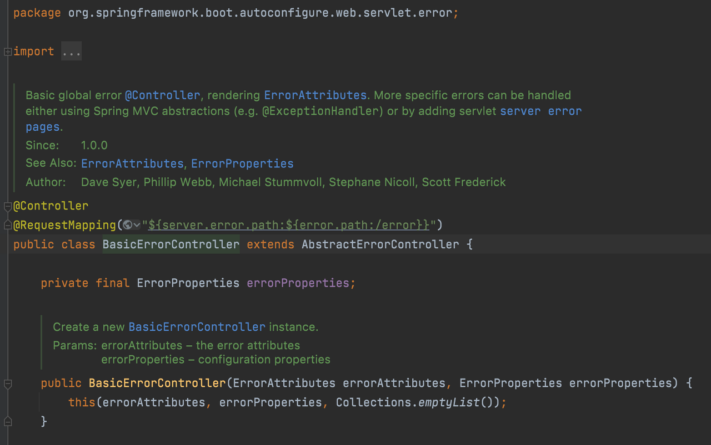
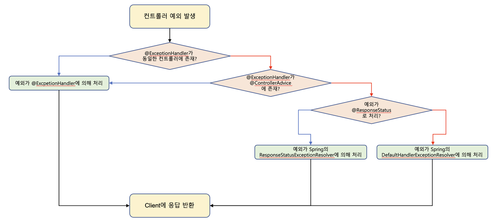
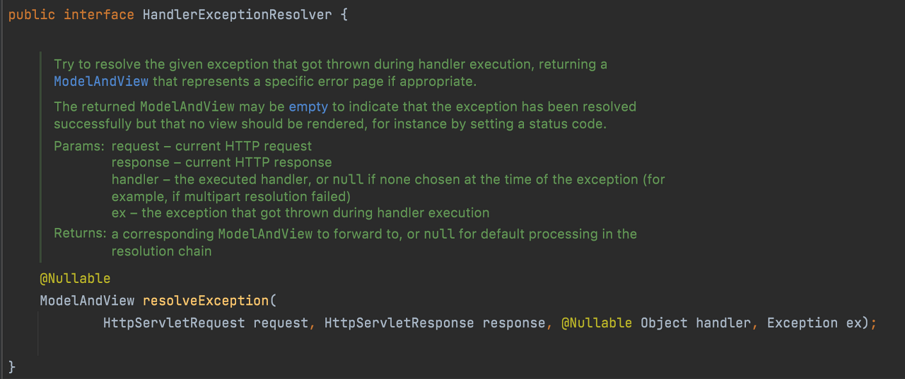

안녕하세요. 현재 데브코스 4기로 활동 중인 모아밤팀 서버 개발자 홍혁준입니다.  
이번 포스팅에서 **예외 처리**에 대해 이야기를 풀어내 보려고 합니다. 감사합니다.

---

## 배경

모아밤에서는 @RestControllerAdvice와 @ExceptionHandler를 통해 예외 
처리를 진행하고 있습니다. 하지만 왜? 해당 방식을 사용할까요? 단순 예외 처리가 아닌 
일반적인 요청 흐름과 예외 발생 시, 흐름을 파악하여 왜 해당 방식을 사용하게 되었는 지 살펴봅시다!

## 사전 지식

### BasicErrorController

스프링은 예외 처리를 위한 BasicErrorController를 
구현했습니다. 그리고 스프링 부트는 예외 발생 시, 기본적으로 `/error`로 
예외 요청을 다시 전달하도록 WAS 설정이 되어 있습니다. 
즉, 별도 설정이 없다면 예외 발생 시, BasicErrorController로 예외 
처리 요청이 전달됩니다.



BasicErrorController는 accept Header에 따라 예외 페이지를 
반환하거나 예외 메시지를 반환합니다. 
예외 경로는 위에서 말했듯, 기본적으로 `/error`로 정의되어 있습니다.

### 스프링의 예외 처리 흐름



**ExceptionHandlerExceptionResolver 동작**

1. 예외 발생 시 컨트롤러 안에 적합한 @ExceptionHandler가 있는 지 검사합니다.
2. 있다면 처리하고 없다면, @RestControllerAdvice로 넘어갑니다.
3. @RestControllerAdvice 안에 적합한 @ExceptionHandler가 있으면 처리하고 없다면, 다음 처리기로 넘어갑니다.

<br/>

**ResponseStatusExceptionResolver 동작**

1.  @ResponseStatus 혹은 ResponseStatusException가 있는 지 검사합니다.
2.  있다면, ServletResponse의 `sendError()`로 예외를 서블릿까지 전달합니다.
3.  서블릿은 BasicErrorController로 요청 전달합니다.

<br/>

**DefaultHandlerExceptionResolver 동작**

-   스프링 내부 예외인 지 검사 후 맞다면 예외를 처리합니다.
-   없다면 적합한 ExceptionResolver가 없어서 예외가 서블릿까지 
전달되고 서블릿은 스프링 부트가 진행한 자동 설정에 맞게 BasicErrorController로 요청을 다시 전달합니다.

---

## 요청 흐름

### 기본 요청 흐름

```
WAS(Tomcat) -> Filter -> Servlet(Dispatcher-Servlet) -> Interceptor -> Controller
```

### 컨트롤러에서 예외 발생 시, 기본 요청 흐름

WAS에 도착하면 어플리케이션에서 처리를 못하는 예외가 올라왔다고 
판단하고 예외 처리를 진행합니다.

```
Controller(Error!) -> Interceptor -> Servlet(Dispatcher Servlet) -> Filter -> WAS(Tomcat) 
-> Filter Servlet(Dispatcher Servlet) -> Interceptor -> Controller(BasicErrorController)
```

이처럼 기본적인 예외 처리 방식은 아래와 같이 결국 `Exception Controller`를 
한 번 더 호출하게 됩니다. 즉, 필터와 인터셉터도 다시 호출되는 
것이죠. 정리하면, 이는 요청이 2번 생기는 것이 아닌, 1번의 요청이 2번 전달되는 
것이게 되므로 이를 제어할 수 있도록 별도의 설정이 필요해 보입니다.

---

## 해결하기

### try-catch

보통 자바에서는 `try-catch`를 통해 예외 처리를 합니다. 하지만 모든 코드에 
`try-catch` 문을 붙이는 것은 매우 비효율적입니다.

<br/>

### @ResponseStatus

@ResponseStatus는 HTTP Status를 변경하도록 도와주는
어노테이션이지만, BasicErrorController에 의한 응답입니다.
즉, @ResponseStatus을 처리하는 ResponseStatusExceptionResolver는
WAS까지 예외를 전달시키기 때문에 1번의 요청이 2번 전달됩니다.

<br/>

### ResponseStatusException

ResponseStatusException은 Spring5 버전부터 제공하는 @ResponseStatus의 대안입니다. 

ResponseStatusException은 Http Status와 함께 선택적으로 
`reason/cause`를 추가할 수 있을 뿐만 아니라, 언체크 예외도 
상속받고 있어서 명시적으로 예외 처리를 하지 않아도 됩니다. 즉, Http Status를
직접 설정해 예외 클래스와 결합도를 낮추고 기본적인 예외 처리를 빠르게 적용하여 
손쉽게 프로토타이핑할 수 있습니다. 하지만 여전히 ResponseStatusExceptionResolver가 예외를 처리합니다.

<br />

### @RestControllerAdvice와 @ExceptionHandler

@ExceptionHandler 어노테이션은 컨트롤러 클래스 혹은 
@RestControllerAdvice가 있는 클래스의 메소드에 해당 
어노테이션을 추가하고 예외 클래스를 속성으로 받아 
손쉽게 예외 처리를 할 수 있도록 도와줍니다. 
즉, @RestControllerAdvice는 @ExceptionHandler를 
전역적으로 제공할 수 있도록 스프링에서 제공하는 어노테이션입니다.



또한 위에서 말했듯 @RestControllerAdvice와 
@ExceptionHandler는 스프링에서 예외 처리 공통 관심사(Cross-Cutting Concerns)를 
메인 로직으로부터 분리해 다양한 예외 처리 방식을 고안한 방식인 
HandlerExceptionResolver의 구현체 중 ExceptionHandlerExceptionResolver로 처리하게 됩니다.

ExceptionHandlerExceptionResolver는 발생한 예외를 잡고 
HTTP 상태나 응답 메시지를 설정하기 때문에, WAS 입장에선 해당 요청이 
정상적인 응답인 것으로 인식되어 위와 다르게 WAS의 에러 전달이 진행되지 않습니다.

이러한 이유로 모아밤에서는 @RestControllerAdvice와 
@ExceptionHandler 예외 처리 방식을 선택하게 되었습니다. 감사합니다.

---

## Reference

-   [예외 처리 - 홍도산](https://hongdosan.tistory.com/entry/8-9-%EC%A3%BC%EC%B0%A8-%EC%98%88%EC%99%B8-%EC%B2%98%EB%A6%AC)
-   [@RestControllerAdvice를 이용한 스프링 예외 처리](https://mangkyu.tistory.com/205)

```toc
```
