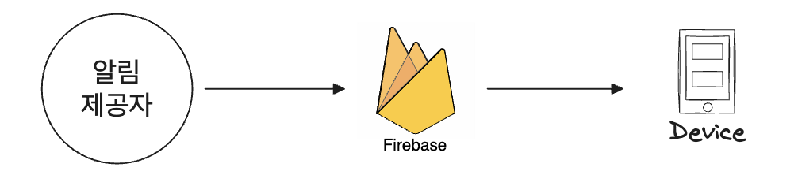
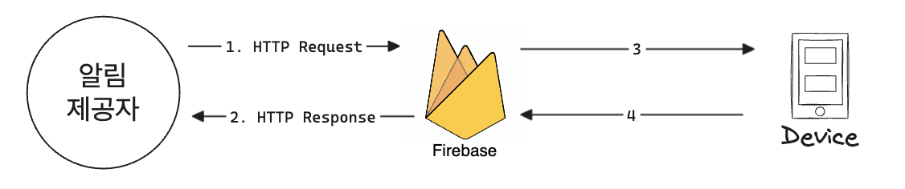
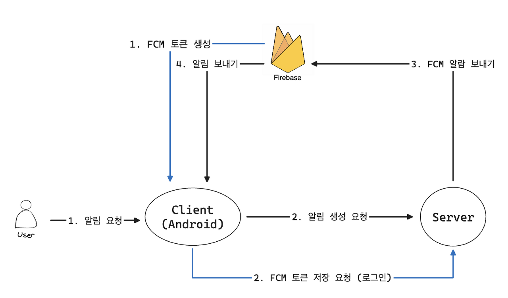
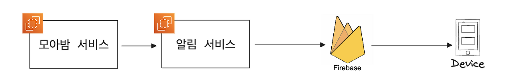
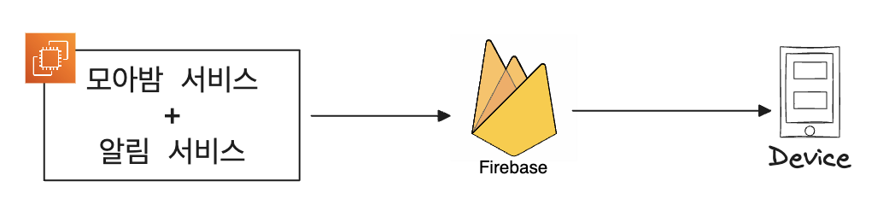
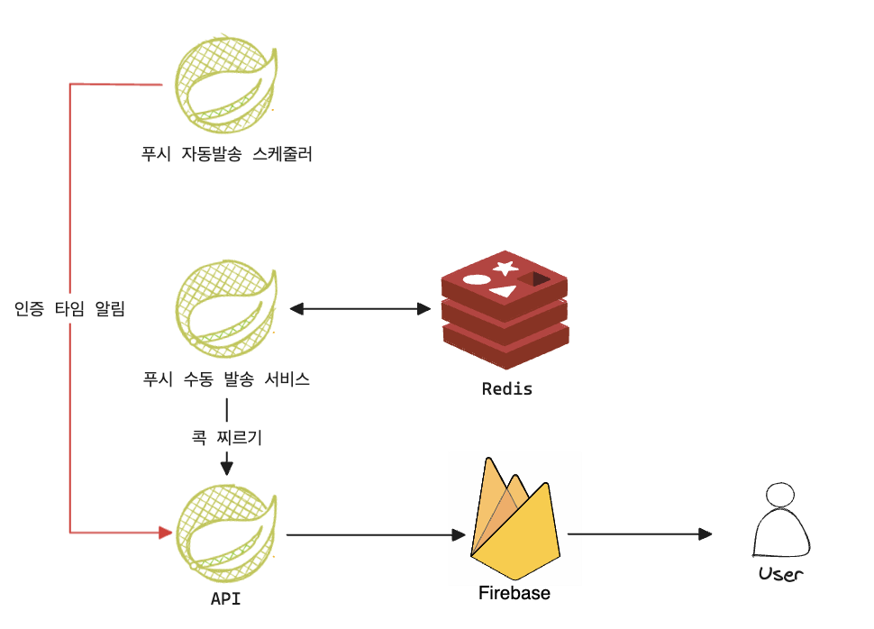
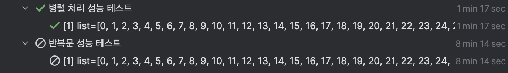
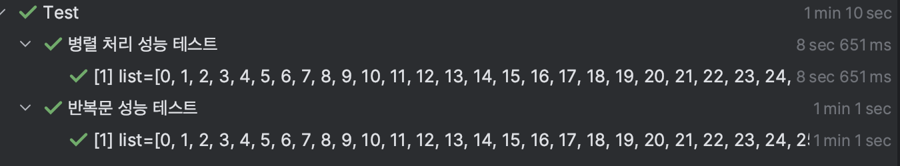
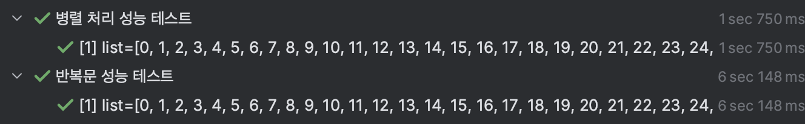
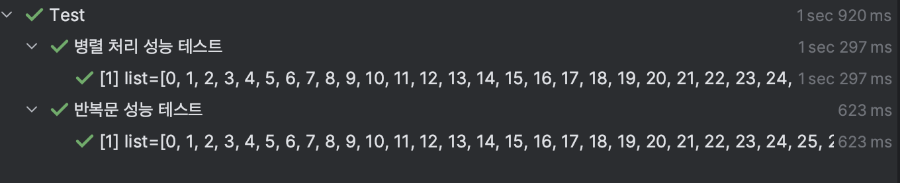

안녕하세요. 현재 데브코스 4기로 활동 중인 모아밤팀 서버 개발자 홍혁준입니다.

이번 포스팅에서 `FCM Push`에 대해 이야기를 풀어내 보려고 합니다. 감사합니다.

---

## 모아밤 서비스에는 어떤 Push 알림이 필요할까?

푸시 알림이란 사용자가 서비스를 사용하고 있지 않은 상황에서도 사용자에게 알림을 보내는 방법입니다.

푸시 알림을 가장 단순하게 구현하는 방법은 `Polling` 방식으로 주기적으로 서버에 편지 도착 여부를 묻는 `HTTP` 요청을 보내는 방법이 있는데요. 이 `Polling` 방식은 `Short Polling`과 `Long Polling` 방식이 있는데, `Short Polling`은 서버가 줄 데이터가 없음에도 주기적으로 요청과 응답 작업을 반복해야 해서 불필요한 트래픽이 발생합니다. 반면 `Long Polling`은 `Short Polling` 방식에 비해 불필요한 요청과 응답을 반복하지 않아도 되지만, 클라이언트와 연결을 계속 유지해야 해서 서버 자원을 소모하게 되죠. 이런 단점들로 인해 `FCM`을 찾아보게 되었습니다.

모아밤 서비스는 앱, 웹을 지원해야 합니다. 그리고 현재 모아밤에서 구현하고자 하는 기능은 사용자가 원할 때, 다른 사용자에게 제한된 횟수만큼 알림을 보내야 합니다. 또한 서버 시간에 따라서 주기적으로 푸시 알림을 보내는 기능입니다. 이런 요구사항을 종합해 봤을 때, `FCM`을 선택하게 되었습니다. 그럼 이제 `FCM`을 도입하기 전 사전지식을 얻어봅시다.

---

## FCM(Firebase Cloud Messaging)

`FCM`은 무료로 메시지를 안정적으로 전송할 수 있는 교차 플랫폼 메시징 솔루션입니다. 이는 특정 개인에게 메시지를 보낼 수도 있고 특정 토픽을 구독하는 사용자에게 전체 메시지를 보낼 수도 있죠.

주요 기능으로는 사용자에게 표시되는 푸시 알림 메시지 전송과 애플리케이션 단에서 처리하는 데이터 메시지 전송이 있습니다. 또한 단일 기기 (특정 사용자), 기기 그룹 (사용자 그룹), 주제를 구독한 기기 (토픽의 구독)을 타겟팅 할 수도 있습니다. 자세한 정보는 [공식 문서](https://firebase.google.com/docs/cloud-messaging/concept-options?hl=ko)를 확인 바랍니다.

---

### FCM Token 이란?

어플리케이션이 FCM 서버와 통신하기 위해 사용되는 고유한 식별자로어플리케이션이 서버와 통신할 때 토큰을 사용해 FCM 서버에서 어플리케이션을 식별하고 이를 통해 메시지 전송을 할 수 있습니다.

#### 토큰 생성

어플리케이션을 처음 실행할 때 FCM SDK는 클라이언트 인스턴스에 대한 등록 토큰을 생성합니다.

#### 토큰 만료

FCM 토큰은 정해진 수명이나 갱신 주기는 없고 아래의 이벤트가 발생할 때 만료합니다.

-   어플리케이션 인스턴스 ID를 삭제했을 때,
-   어플리케이션이 새 기기에서 복원되었을 때,
-   사용자가 어플리케이션을 제거 및 재설치했을 때,
-   사용자가 어플리케이션 데이터를 지웠을 때,

---

### 푸시 알림을 위한 3가지 컴포넌트



#### 알림 제공자 (Service Application)

알림 요청을 만들어 `FCM`으로 보내주는 주체로 알림 요청을 위해서는 알림 요청을 보내는 데 
필요한 고유 식별자인 단말 토큰과 알림 내용을 담은 `JSON` 딕셔너리 형식의 페이로드(`Payload`)가 필요합니다.

#### FCM

`Google`이 제공하는 원격 서비스로 푸시 알림을 다양한 플랫폼으로 보내는 역할을 담당합니다. 
즉, `FCM`은 안드로이드, `iOS`, 웹을 포함한 다양한 플랫폼의 사용자에게 메시지를 보낼 수 있는 크로스 플랫폼 메시징 솔루션입니다.

#### 디바이스 장치

푸시 알림을 수신하는 사용자 단말기입니다.

---

### FCM 토큰의 신성도 보장

서버 개발에서 핵심은 토큰의 신선도 보장이라고 생각합니다. [Firebase 공식 문서](https://firebase.google.com/docs/cloud-messaging/manage-tokens?hl=ko)에서도 언급됐지만, 데이터베이스에 토큰이 쌓이다 보면 주기적 알림 서비스의 경우에 발생할 수 있는 이슈가 존재합니다. 오래된 등록 토큰이 있는 비활성 장치에 메시지를 전송하면 리소스를 낭비하게 되고 푸시 알림의 전송 속도가 느려질 수 있기 때문이죠.

따라서 주기적으로 토큰의 타임스탬프를 업데이트하는 서버 로직을 추가하고 오래된 토큰을 판정하기 위한 임계 기간 동안 토큰을 사용하지 않은 유저의 토큰을 삭제하고 업데이트하는 것이 좋을 것 같습니다.

---

### FCM 흐름



1.  가장 먼저 `FCM`과 앱을 연동합니다.
2.  알림 제공자(서비스 어플리케이션)는 `FCM`에 단말 토큰과 페이로드를 담아서 `HTTP POST` 요청을 보냅니다.
3.  요청을 받은 `FCM`은 알림 제공자에게 적절한 `HTTP` 응답을 보냅니다.
4.  `FCM`은 메시지 우선순위, 수신 단말과의 통신 가능 여부 등을 고려해 메시지를 수신 단말에 보냅니다.
5.  수신 단말은 정보 이상 유무에 따라 적절한 `HTTP` 응답을 보냅니다.

이렇게만 보면 이해가 잘 안갈 수도 있습니다. 더 자세한 흐름을 보여드리겠습니다.



가장 먼저 기기가 어플리케이션을 설치 및 사용할 경우 발생합니다.

1.  `Firebase`가 클라이언트에게 FCM 토큰을 생성해줍니다.
2.  클라이언트는 `Firebase`로부터 받은 `FCM Token`을 서버에게 저장 요청을 보냅니다.

그리고 나서, 사용자가 클라이언트에 알림 요청하는 경우 발생합니다. 그리고 위 이미지에는 없지만 서버 자체에서 알람 요청을 하는 경우도 있습니다.

1.  클라이언트가 서버로 알림 생성 요청을 보냅니다.
2.  서버는 보내려는 메시지 데이터를 FCM 서버에 알람 요청을 합니다.
3.  FCM 서버는 해당 서버가 올바른지 확인 후 클라이언트에게 푸시 알람을 보냅니다.

이제 사전지식을 어느정도 습득했으니 어떻게 도입했는 지 살펴봅시다.

---

## 알림 아키텍처

모아밤 프로젝트에서 필요한 요구사항은 다음과 같습니다.

-   방 참여자들은 다른 참여자들에게 12시간마다 1회의 콕 찌르기 알림을 보낼 수 있다.
-   방 내의 루틴 인증 시작 타임이 된다면 방 참여자들에게 알림이 간다.

요구사항을 봤을 때, 알림 제공자 역할을 하는 별도 인스턴스를 생성해 애플리케이션 서버와 알림 서버를 분리해야 할 지, 아니면 어플리케이션 서버에 알림 기능을 추기할 지 고민이 됩니다.



아무래도 어플리케이션에 존재하는 모든 방의 모든 참여자에게 알림을 인증 타임마다 보내야 하니, 푸시 알림 시스템이 대량 요청을 처리할 것으로 예상은 됩니다. 따라서 효과적으로 작동하는 데 필요한 리소스와 용량을 확보하기 위해 위 이미지와 같이 별도 인스턴스를 사용하는 것이 유용할 수도 있을 것 같습니다. 또한 별도 인스턴스를 사용하면 푸시 알림 시스템에 대한 격리 및 제어 기능을 더 많이 제공할 수도 있을 것 같습니다.



하지만 현재의 모아밤 서비스를 본다면, 주기적인 알림 외는 콕 찌르기를 하는 경우에만 알림 요청이 발생하고, 아직 개발 시작 단계이기 때문에, 사용자가 존재하지 않습니다. 만약 개발이 끝나고 운영 단계라고 하여도 사용자가 그리 많지 않을 것 같습니다. 😢 때문에 기존 응용 프로그램과 동일한 인스턴스를 사용하기로 결정했습니다.



추가적으로 요구사항을 보면 "인증 타임 당 1회의 콕 찌르기 알림을 보낼 수 있다."를 충족하기 위해, `Redis` 저장소를 활용할 것입니다. 또한 정해진 인증타임에 푸시를 자동발송 해야하니 스케쥴러를 활용할 예정입니다. 즉, 위 이미지와 같은 아키텍처가 나오게 됩니다.

해당 아키텍처 선정 이유를 정리하면 다음과 같습니다.

-   현재 상황에선 하나의 `EC2`로도 충분합니다. 굳이 2개로 분리하는 것은 비용 문제가 발생합니다.
-   초기 서비스이기 때문에, 사용자가 적은 만큼 트래픽이 많이 발생하지 않습니다. 즉, 인증 타임마다 `Spring Batch`를 돌리기엔, 서버가 너무 무거워집니다. 오버 엔지니어링입니다.
-   인증 타임이 됐을 때, 시간 내에 인증을 해야 해서 신속하게 푸시 메시지가 발송되도록 카프카를 적용하는 것도 고려해볼 수 있습니다. 하지만, 위와 동일한 이유로 오버 엔지니어링이라고 생각합니다.
-   주니어 개발자로서 아직은 현재 사용되는 기술에 대한 이해와 공부가 먼저입니다.

위와 같은 이유로 해당 아키텍처로 진행하게 되었습니다.

---

## 모아밤의 FCM 도입기

### 디펜던시 등록

`build.gradle`을 설정합니다.

```
// Firebase Admin
implementation 'com.google.firebase:firebase-admin:9.2.0'
```

---

### Firebase 연동 준비

Firebase 연동 준비는 제가 참고한 [React + FCM 구현하기](https://velog.io/@heelieben/FCM-React-Web-Push-%EA%B5%AC%ED%98%84%ED%95%98%EA%B8%B0-feat.-pwa-service-worker)와 [FCM 푸시 파헤치기](https://zuminternet.github.io/FCM-PUSH/)를 참고하시면 됩니다!

---

### Spring Boot 설정

**1) Firebase Config 설정**

-   `Firebase` 앱 내, 프로젝트의 권한을 얻기 위해서는 `SDK` 권한키를 필수로 보유해야 합니다.
-   공식문서에서 제공된 방식과 다르게 절대 `ClassPathResource`를 활용했습니다.

``` java
@Slf4j
@Configuration
public class FcmConfig {

    @Bean
    public FirebaseMessaging firebaseMessaging() {
        try (InputStream inputStream = new ClassPathResource(FIREBASE_PATH).getInputStream()) {
            GoogleCredentials credentials = GoogleCredentials.fromStream(inputStream);
            FirebaseOptions firebaseOptions = FirebaseOptions.builder()
                .setCredentials(credentials)
                .build();

            if (FirebaseApp.getApps().isEmpty()) {
                FirebaseApp.initializeApp(firebaseOptions);
                log.info("======= Firebase init start =======");
            }

            return FirebaseMessaging.getInstance();
        } catch (IOException e) {
            log.error("======= firebase moabam error =======\n" + e);
            throw new FcmException(ErrorMessage.FAILED_FCM_INIT);
        }
    }
}
```

**2) 콕 찌르기 알림 기능 구현 코드 중 일부분**

-   방 참여자들은 다른 참여자들에게 12시간마다 1회의 콕 찌르기 알림을 보낼 수 있다는 요구사항을 지키기 위해 
`Redis` 저장소를 활용했습니다.
-   콕 찌르기 알림은 사용자들의 중요한 정보라거나, 보안적으로 문제되는 정보라고 생각하지 않았기 때문에, 
`FirebaseMessaging`의 `sendAsync()`를 활용했습니다. 즉, `Firebase` 서버로 비동기 요청을 하여 성능을 챙겼습니다. 

``` java
@Transactional
public void sendKnockNotification(MemberTest member, Long targetId, Long roomId) {
    String knockKey = generateKnockKey(member.memberId(), targetId, roomId);
    validateConflictKnockNotification(knockKey);
    validateFcmToken(targetId);

    Notification notification = NotificationMapper.toKnockNotificationEntity(member.nickname());
    sendAsyncFcm(targetId, notification);
    notificationRepository.saveKnockNotification(knockKey);
}

private void sendAsyncFcm(Long fcmTokenKey, Notification notification) {
    String fcmToken = notificationRepository.findFcmTokenByMemberId(fcmTokenKey);
    Message message = NotificationMapper.toMessageEntity(notification, fcmToken);

    firebaseMessaging.sendAsync(message);
}


private void validateConflictKnockNotification(String knockKey) {
    if (notificationRepository.existsByKey(knockKey)) {
        throw new ConflictException(ErrorMessage.CONFLICT_KNOCK);
    }
}

private void validateFcmToken(Long memberId) {
    if (!notificationRepository.existsFcmTokenByMemberId(memberId)) {
        throw new NotFoundException(ErrorMessage.NOT_FOUND_FCM_TOKEN);
    }
}

private String generateKnockKey(Long memberId, Long targetId, Long roomId) {
    return requireNonNull(roomId) + UNDER_BAR + requireNonNull(memberId) + TO + requireNonNull(targetId);
}
```

**3) 인증 타임에 따른 알림 중 일부분**

-   방 내의 루틴 인증 시작 타임이 된다면 방 참여자들에게 알림이 간다. 라는 요구사항을 지키기 위해 스케줄러를 활용했습니다.
-   성능을 위해 병렬 스트림을 활용했습니다.

``` java
/**
 * CRON_CERTIFY_TIME_EXPRESSION : "0 50 * * * *";
 * ONE : 1
 * HOURS_IN_A_DAY : 24
 */
@Scheduled(cron = CRON_CERTIFY_TIME_EXPRESSION)
public void sendCertificationTimeNotification() {
    int certificationTime = (LocalDateTime.now().getHour() + ONE) % HOURS_IN_A_DAY;
    List<Participant> participants = participantSearchRepository.findAllByRoomCertifyTime(certificationTime);

    participants.parallelStream().forEach(participant -> {
        String roomTitle = participant.getRoom().getTitle();
        Notification notification = NotificationMapper.toCertifyAuthNotificationEntity(roomTitle);
        sendAsyncFcm(participant.getMemberId(), notification);
    });
}

private void sendAsyncFcm(Long fcmTokenKey, Notification notification) {
    String fcmToken = notificationRepository.findFcmTokenByMemberId(fcmTokenKey);
    Message message = NotificationMapper.toMessageEntity(notification, fcmToken);

    firebaseMessaging.sendAsync(message);
}
```

---

## 병렬 스트림과 반복문 성능 비교

### 배경

현재 모아밤 서비스의 요구사항에 따른 인증 타임 알림 서비스는 레이스 컨디션이 발생해도 문제가 발생하지 않는 로직입니다. 또한 사용자가 늘어나면 늘어날수록 반복이 배로 늘어나게 됩니다. 때문에 병렬 스트림을 쓰는 것에 대해 고민을 하게 되었습니다.

### 고민 사항

-   현재 로직만 봤을 때, 반복문 내에서 지연되는 부분이 없는 데 병렬 처리가 단순 반복문보다 성능이 좋을까요?
-   `Stream`의 내부적으로 동작하는 박싱, 언박싱을 고려했을 때, 병렬 처리가 단순 반복문보다 성능이 좋을까요?

고민사항을 토대로 어떻게 결론을 내릴까 하다가, **백문이 불여일견**처럼 직접 테스트를 해보고 결론을 내리도록 했습니다.

### 성능 테스트

**1) `Firebase`의 `sendAsync` 요청 시간 : 5ms**


**2) 임의 리스트 생성 후 테스트 성능 : 100\_000 (십만)**

-   일반 반복문이 너무 오래 걸려 중단했습니다. 그 정도로 큰 차이가 났습니다.



**2) 임의 리스트 생성 후 테스트 성능 : 10\_000 (일만)**

-   약 7~8배 차이로 병렬 처리가 더 좋았습니다.



**3) 임의 리스트 생성 후 테스트 성능 : 1\_000 (천)**

-   약 6배 차이로 병렬 처리가 더 좋았습니다.



**4) 임의 리스트 생성 후 테스트 성능 : 100 (백)**

-   드디어 단순 반복문 성능이 더 좋네요. 즉 값이 적을 때는 단순 반복문이 더 빠른 것 같습니다.



### 결론

테스트를 통해 사용자가 많아지면 많아질수록 병렬처리가 더 좋다는 결과를 도출했기 때문에 병렬 처리로 결론을 내렸습니다. 감사합니다.

---

## Reference

-   [React + FCM 구현하기](https://velog.io/@heelieben/FCM-React-Web-Push-%EA%B5%AC%ED%98%84%ED%95%98%EA%B8%B0-feat.-pwa-service-worker)
-   [FCM 도입 시 고려해야 할 사항](https://seungwoolog.tistory.com/88)
-   [FCM 등록 토큰 관리 모범 사례 - 공식문서](https://firebase.google.com/docs/cloud-messaging/manage-tokens?hl=ko)
-   [FCM 푸시 파헤치기 - ZUM Internet Tech](https://zuminternet.github.io/FCM-PUSH/)
