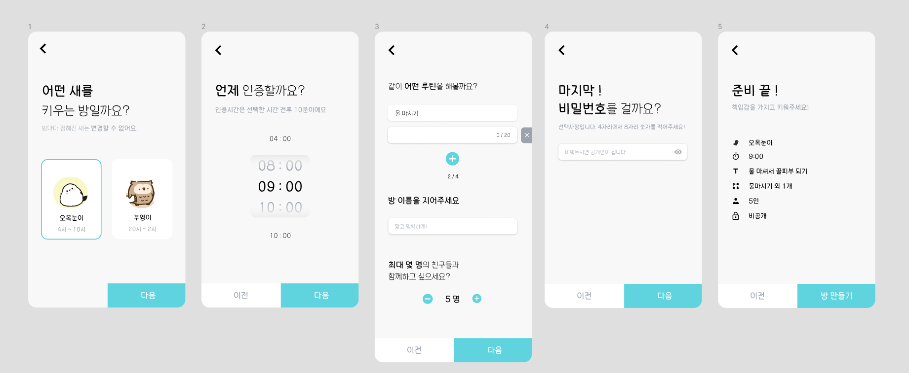
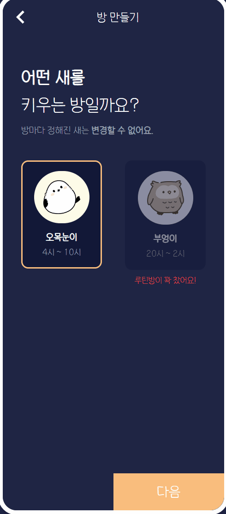

안녕하세요. 모아밤 팀의 프론트엔드 개발자 이상훈입니다.

## 서론



사용자에게 서비스가 복잡하다는 인상을 주지 않도록 한 번에 많은 정보를 노출하지 않고 **순차적으로 제공하는 패턴**을 이용하기도 합니다.

모아밤 프로젝트도 이런 패턴을 그룹방을 만드는 기능에서 활용해 보았는데요, 사용자 경험 측면에서 스크롤이 길어지는 것 보다는 다른 스텝으로 나누어서 제공하는 것이 좋다는 판단을 했었기 때문입니다. 이번 글에서는 퍼널 컴포넌트를 개발했던 이야기를 공유해보고자 합니다.

## 구현 방법 고민

이러한 기능을 구현하는 방법에는 크게 2가지가 있겠다고 생각했고, 각각의 방법을 채택했을 때의 특징도 고려해보았습니다.

1. **각각의 스텝마다 페이지 라우팅 경로 지정하기**

   - 스텝마다 router 객체에 등록해야 하는데, 스텝이 많아질수록 번거로운 과정이 될 수 있다고 생각했습니다.
   - 사용자가 URL를 임의로 변경하여 중간 스텝을 건너뛸 수 있다고 생각했습니다.

2. **하나의 페이지 컴포넌트에서 상태에 따라 조건부 렌더링하기**
   - 조건부 렌더링 로직을 잘 관리하지 않으면 컴포넌트의 복잡도가 늘어날 수 있다고 생각했습니다.

저희는 2번 방법을 선택했는데요, 만약 화면에 제공되는 뒤로가기 버튼이 없는 상황이라면 이전 스텝으로 이동하는 기능을 고려하여 브라우저 히스토리가 남도록 라우팅 기반으로 작업하는 것이 좋겠지만, 저희는 상호작용할 수 있는 뒤로가기 버튼이 존재하기도 하며 사용자가 URL을 **임의로 변경하여 중간 스텝으로 넘어가는 걸 제한하고 싶었기 때문**입니다.

또한 진유림님의 퍼널 세션에서 받았던 영감을 실제로 활용해보는 경험을 하고 싶었습니다.

## 퍼널 컴포넌트 추상화

toss/slash 라이브러리의 [useFunnel](https://github.com/toss/slash/blob/main/packages/react/use-funnel/src/useFunnel.tsx)은 꽤나 다양한 기능을 제공해주지만, 참고하여 모아밤에서 활용하기에 좋을 핵심적인 특징만 추려보았습니다.

1. 스텝 별 보여줘야 할 UI를 **한 곳에 응집하여 선언적으로 관리**
2. 이전과 다음 **스텝의 존재 확인 및 이동 함수**

조건부에 따라 스텝 컴포넌트를 렌더링하는 역할이 필요했기 때문에 이 기능을 페이지 컴포넌트가 담당하도록 했고 하단 네비바에 보여줘야 할 컨텐츠도 이전 스텝 및 다음 스텝의 여부에 따라서 달라지기 때문에 체크하는 로직을 구현했습니다.

결론적으로는 2가지의 컴포넌트와 1가지의 커스텀 훅을 구현해야 했습니다.

> 💡 **커스텀 훅이 필요할까?**  
> 사실 커스텀 훅을 만들지 않아도 괜찮지 않을까? 싶은 생각을 잠깐 했었는데요. `Funnel` 컴포넌트를 [Compound 패턴](https://patterns-dev-kr.github.io/design-patterns/compound-pattern/)으로 구현한다면 상태를 외부로 드러내지 않고 **현재 스텝과 전체 스텝 정보를 하위 트리에 공유**하는 방법도 있다고 생각했었습니다. 그러나 `Funnel` 컴포넌트의 역할이 무거워지고 로직이 복잡해질 수 있기에 `useFunnel` 훅으로 따로 구현하게 되었습니다.

### Step 컴포넌트

Step 컴포넌트는 아주 간단한 역할을 수행합니다.  
스텝 이름 목록 중 하나의 값을 외부로부터 받아서 `name` 프로퍼티로 갖고, 그대로 하위 노드를 렌더링합니다.

(이는 `Funnel` 컴포넌트가 어떤 스텝을 렌더링해야 할 지 식별하는 역할을 합니다.)

```tsx
export interface StepProps<T extends readonly string[]> {
  name: T[number];
  children: React.ReactNode;
}

const Step = <T extends readonly string[]>({ children }: StepProps<T>) => {
  return <>{children}</>;
};

export default Step;
```

### Funnel 컴포넌트

Funnel 컴포넌트는 현재 보여줘야 할 스텝의 이름을 `step` 프로퍼티로 받고, 하위 트리에서 **이름이 일치하는 스텝 컴포넌트를 찾아서 렌더링**하는 역할을 수행합니다.

중요한 포인트는 <b style="color: red">**하위 트리로는 반드시 Step 컴포넌트**</b>만 들어올 수 있도록 필터링하기에, Funnel의 한 단계 아래 트리는 반드시 `Step` 컴포넌트여야 한다는 점입니다.

(만약 다른 컴포넌트라면 스텝 이름으로 구성된 `name` 프로퍼티를 가졌다는 보장을 할 수 없기 때문입니다.)

```tsx
import React from 'react';
import Step, { StepProps } from './Step';

interface FunnelProps<T extends readonly string[]> {
  step: T[number];
  children: React.ReactNode;
}

const Funnel = <T extends readonly string[]>({ step, children }: FunnelProps<T>) => {
  const validChildren = React.Children.toArray(children)
    .filter(React.isValidElement)
    .filter((child) => child.type === Step) as React.ReactElement<StepProps<T>>[];

  const currentStep = validChildren.find((child) => child.props.name === step);

  if (!currentStep) {
    throw new Error(`Funnel의 children 중에서 ${step} 스텝이 존재하지 않습니다.`);
  }

  return <>{currentStep}</>;
};

export default Funnel;
```

### useFunnel 훅

useFunnel 훅은 스텝 이름이 될 수 있는 문자열을 배열로 받고, 현재 스텝의 이름을 상태로 관리합니다.

또한 이전 스텝과 다음 스텝을 관리하는 함수를 반환합니다.

```tsx
import { useState } from 'react';

const useFunnel = <T extends readonly string[]>(steps: T, initialStep: T[number] = steps[0]) => {
  const [step, setStep] = useState<T[number]>(initialStep);
  const currentIdx = steps.indexOf(step);

  const hasPrev = currentIdx > 0;
  const hasNext = currentIdx < steps.length - 1;

  const toPrev = () => {
    if (hasPrev) {
      setStep(steps[currentIdx - 1]);
    }
  };

  const toNext = () => {
    if (hasNext) {
      setStep(steps[currentIdx + 1]);
    }
  };

  return { step, setStep, hasPrev, toPrev, hasNext, toNext };
};

export default useFunnel;
```

> 💡 **컴포넌트를 반환하는 훅?**  
> 커스텀 훅은 일반적으로 로직만 포함되는 곳으로 생각을 했었는데요, toss/slash의 [useFunnel](https://github.com/toss/slash/blob/main/packages/react/use-funnel/src/useFunnel.tsx#L57) 훅에서는 받았던 steps 배열로 타입을 유추해 `Funnel` **컴포넌트를 메모이제이션하여 반환**하는 형태로 구현되어 있었습니다. **(.tsx)**  
> 이런 방식을 사용한 덕분에 각 Step 컴포넌트에서 스텝 타입을 제네릭으로 일일히 넣어주지 않아도 되는 장점이 있었고, 저도 유사한 방식을 시도했었습니다.  
> 하지만 `framer-motion` 라이브러리의 `AnimatePresence` 가 적용되지 않았던 현상을 겪고 로직만 반환하는 형태로 구현하게 되었습니다.

## 퍼널 사용해보기

이제 구현했던 퍼널을 가지고 실제로 순차적인 페이지의 흐름을 한 곳에서 선언적으로 관리할 수 있습니다.  
중요한 포인트는 useFunnel 훅의 인자로 들어가는 스텝 배열에 `as const` 키워드를 사용하는 부분인데요, 이는 <b style="color: red;">**Step 컴포넌트의 name 필드에 들어가는 문자열을 정확한 값으로 제한**</b>하는 역할을 합니다.

또한 JSX 트리에 작성한 Step 컴포넌트의 순서와는 상관없이 무조건 **훅을 선언했을 때 들어간 배열의 순서**로 내용이 보여지는 점과, **Step 컴포넌트가 아닌 요소는 렌더링에서 무시**된다는 점도 확인할 수 있습니다.

```tsx
function App() {
  const { step, hasNext, hasPrev, toNext, toPrev } = useFunnel([
    '방선택',
    '인증시간',
    '루틴정보',
    '비밀번호',
    '마무리',
  ] as const);

  return (
    <>
      <Funnel step={step}>
        <Step name="마무리">마무리 페이지</Step>
        <Step name="방선택">방선택 페이지</Step>
        <Step name="인증시간">인증시간 페이지</Step>
        <Step name="루틴정보">루틴정보 페이지</Step>
        <Step name="비밀번호">비밀번호 페이지</Step>
        <div>Step 컴포넌트가 아닌 요소는 렌더링에서 무시돼요.</div>
        <div>
          children에 순서를 뒤죽박죽으로 등록해도 steps 배열에 들어가있는 순서로 스텝을 보여줘요.
        </div>
      </Funnel>
      <div>
        {hasPrev && <button onClick={toPrev}>이전으로</button>}
        {hasNext && <button onClick={toNext}>다음으로</button>}
      </div>
    </>
  );
}
```


### 문제점

하지만 Step 컴포넌트를 사용하는 데 불편한 점이 있는데요. Step 컴포넌트에 보낼 제네릭 타입을 부여하지 않으면 name 필드로 받을 수 있는 문자열을 제한할수도, 어떤 문자열이 들어오는지를 알려주는 개발 도구의 Intellisense 기능도 활용할 수 없습니다. 때문에 매 스텝을 선언할 때마다 반복적으로 제네릭 인자를 전달해줘야 합니다.


toss/slash 의 useFunnel 훅에서는 스텝 이름을 제네릭 타입으로 넣은 컴포넌트를 반환해주기 때문에 이런 문제가 없지만, 저희는 훅에서 컴포넌트를 반환하지 않았기 때문에 발생하는 문제였습니다.

하지만 구현 과정에서 `framer-motion` 라이브러리와의 문제도 있었기도 하고, 훅에서 컴포넌트를 반환하는 형태는 지양하고 싶었기에 다른 방법을 찾아보기로 합니다.

### createFunnel

toss/slash 의 useFunnel 훅이 컴포넌트를 만들어주는 역할을 하는 것처럼 저희도 인자로 받은 **스텝 정보를 통해서 컴포넌트 함수를 반환해주는 헬퍼 함수**를 만들면 어떨까? 싶은 생각을 하게 되었습니다.

```tsx
const createFunnel = <T extends readonly string[]>(steps: T) => ({
  Funnel: Funnel<T>,
  Step: Step<T>,
  useFunnel: (initialStep?: T[number]) => useFunnel<T>(steps, initialStep)
});
```

그렇게 해서 만든 createFunnel은 steps 배열을 제네릭 타입으로 받은 뒤, 페이지에서 활용할 수 있는 Funnel, Step, useFunnel 을 반환하는 간단한 역할을 수행하는 함수입니다.

```tsx
const { Funnel, Step, useFunnel } = createFunnel([
  '방선택',
  '인증시간',
  '루틴정보',
  '비밀번호',
  '마무리',
] as const);

function App() {
  const { step } = useFunnel();

  return (
    <Funnel step={step}>
      <Step name="마무리">마무리 페이지</Step>
      <Step name="방선택">방선택 페이지</Step>
      <Step name="인증시간">인증시간 페이지</Step>
      <Step name="루틴정보">루틴정보 페이지</Step>
      <Step name="비밀번호">비밀번호 페이지</Step>
    </Funnel>
  );
}
```

createFunnel 함수가 제네릭 인자가 전달된 Step 컴포넌트를 반환했기 때문에, 이제 매 번 Step 컴포넌트의 제네릭 인자를 명시하지 않아도 됩니다.

### 완성된 화면



## 더 고민하면 좋을 부분

### 뒤로가기 버튼이 없다면? or 중간 스텝에 들어가고 싶다면?

지금까지 만든 Funnel 컴포넌트는 스텝 정보를 메모리(상태)에 보관하고 있습니다.

덕분에 사용자가 임의로 중간 스텝을 들어가지 못하도록 제한할 수 있다는 특징이 생겼지만, 반대로 중간 스텝에 들어가도록 기능을 제공하고 싶은 경우도 존재할 것입니다. (ex. 링크 공유) 또한 설계된 화면에서는 뒤로가기 버튼이 존재해서 문제는 없었지만, 만약 그렇지 않은 상황이라면 사용자가 이전 퍼널로 되돌아갈 수 있도록 브라우저 히스토리 스택을 제공해야 하는 경우도 있습니다.

toss/slash의 useFunnel은 이런 경우를 대응하여 Next.js의 `useRouter` 훅에 의존하는 형태로 작성되어 있는데요. 저희는 Next.js 프레임워크를 사용하지 않는 환경이었기에 React Router의 `useNavigate` 훅에 의존하도록 구현하거나, 어떤 라우팅 라이브러리에서도 활용할 수 있도록 어댑터 계층을 만들어서 구현하는 방법도 있겠습니다.

## References

[토스ㅣSLASH 23 - 퍼널: 쏟아지는 페이지 한 방에 관리하기](https://www.youtube.com/watch?v=NwLWX2RNVcw)
