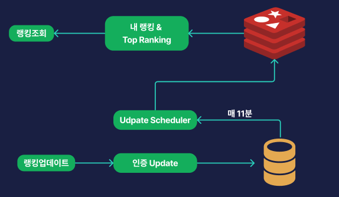

안녕하세요. 모아밤팀의 서버 개발자 박세연입니다!

랭킹 시스템을 도입했던 경험을 공유하고 싶어 작성합니다.

---


## 서비스 분석

모아밤 서비스의 경우 이용자들은 매일 인증을 통해 경험치를 얻게 됩니다. 경험치를 기준으로 랭킹이 있다면, 서로 경쟁을 통해 더욱 열심히 인증을 참여하게 될 것이고, 사용자가 서비스를 지속적으로 사용하게할 수 있는 좋은 방법이라 생각하여 도입하게 되었습니다.

### 랭킹의 기준

모아밤에서 랭킹의 기준은 사용자가 인증할 때 마다 쌓이는 경험치입니다.

### 랭킹에서 보여주는 데이터
랭킹에서는 현재 `사용자의 점수`, `닉네임`, `프로필 이미지`을 보여주고 있습니다.

## 모아밤 랭킹 서비스의 트래픽 특성

랭킹 서비스에서 크게 `랭킹 업데이트`와 `랭킹 조회`, 2가지 트래픽이 존재합니다.

### 랭킹 업데이트
- 매시 15분 모든 회원에 대해 업데이트를 진행

### 랭킹 조회
- 사용자의 요청을 통해 랭킹 조회 페이지에 접근할 때

위와 같은 특성을 봤을 때 대부분의 트래픽은 랭킹조회에서 발생하는 것을 알 수 있습니다.

## 설계

### 1. DB만으로 구성


가장 단순한 구조로 DB만을 사용한 설계입니다. 랭킹 자체가 지금까지 쌓아온 인증 경험치에 대해 매기고 있기 때문에 `랭킹 조회 요청`이 들어오게 되면,
DB에서 쿼리를 통해 조회 후 반환을 하면 되고, 랭킹 순위 기준인 경험치가 업데이트 될 때는, 추가적인 작업이 필요하지 않기 때문에, 빠른 구현이 가능합니다.

만약, 이 상황에서 조회에 대한 조건이 붙는다면?

예를 들어 , `경험치를 기반한 랭킹 조회에서, 최근 일주일간 경험치 증가량에 기반한 랭킹 조회`로 변경이 된다면 어떻게 해야할까요.
이때는, 경험치가 들어오는 값을 매번 기록하는 Board테이블을 만들어서 조회 조건을 추가할 수 있습니다.

### **그렇다면 위 설계의 문제는?**

**1 . 매번 조회 쿼리를 날린다.**

```sql
select nickname,
       member_id,
       profile_url,
       exp,
  from members
GROUP BY member_id
ORDER BY exp DESC
LIMIT 10
```
위와 같이 매번 Grouping과 정렬을 하는 쿼리로 Top Ranking의 정보를 가져오게 됩니다.
이렇게 되면, `조회를 할 때마다 매번 테이블의 모든 데이터를 정렬`해야 합니다.

데이터가 많아지면 점점 병목현상이 심해지고, 인덱스를 적용시키기에는 경험치는 매번 변경이 되기 때문에 적용하기 힘듭니다.

**2 . 조회 쿼리를 날릴때 변경이 될 수 있다.**

경험치가 포함된 테이블의 경우 랭킹이 조회될 때 마다 랭킹의 정보가 사용자의 정보와 동일해야 합니다.
하지만 전체 테이블을 조회하는 쿼리를 매번 날리는 경우, 상황에 따라 다르겠지만 락을 거는 경우가 존재합니다.

mysql의 경우에는 fk가 포함된 update를 하게 되면 x-lock을 걸게 됩니다. 이는 경험치의 값을 업데이트하게 되면 락이 걸리고 이때 랭킹 조회가 바로 되는 것이 아니라
트랜잭션이 끝나는 것을 기다려야 하다 보니 성능상 문제가 있습니다. 

### 2. Redis와 함께 사용
우리 서비스에서 랭킹에 대한 트래픽은 업데이트는 매 정각에서 10분 사이에 인증 경험치를 업데이트 하지만, 조회는 매번 가능하다보니 조회가 압도적으로 많습니다.

그렇다보니 위에서 말한 2문제가 발생했습니다.
따라서 이를 해결하기 위해 caching 기능을 따로 사용하고자 했습니다. 

**인메모리 cache**
고려했던 인메모리 cache의 경우 크게 2가지가 있었습니다.
Global cache였던 redis와 local cache인 caffeine캐시였습니다.

결과적으로는 redis를 선택하게 되었습니다.
그 이유로는, caffeine의 경우 네트워크 IO의 소비가 없고, 비용적인 문제도 적습니다. 다만, 랭킹 조회에 대한 결과가
Top Ranking뿐만 아니라 모든 사용자에 대한 Ranking또한 필요하다보니 많은 메모리를 소모하게 됩니다.
따라서 Local cache에서 감당하기에는 힘들다 판단하였고, redis는 다양한 자료구조가 존재하고, 무엇보다 ranking system을 구축하기에 적합한 sorted set을 제공하기 때문에 선택하였습니다.


위 구조가 변경이 된 구조 입니다.

먼저 `조회`의 경우, 2가지 정도 생각해 볼 수 있었습니다
1. redis에 보여주려는 모든 데이터를 저장하고서 전달 할 것인가.
2. redis에 id(인덱싱 되어있는)를 저장하고, 조회시 가져와서 DB에서 데이터를 가져와서 사용할 것인가 입니다.

이 중 1번을 사용했습니다. redis와 같은 인메모리 캐시를 사용하려는 이유가 DB에 대한 접근 최소한으로 하려하는 것인데 다시 조회할 이유가 없었습니다.

반대로 `업데이트`의 경우에도 2가지를 고민해 볼 수 있었습니다.
1. 인증 경험치가 업데이트 될 때 마다, redis의 데이터도 같이 업데이트 하여 실시간을 유지
2. scheduler를 통해 특정 시간에 업데이트 하도록 하기

업데이트의 경우 가장 중요하게 생각할 수 있는 것은 데이터의 정합성이었습니다. 캐시를 통해 분리하다보니 업데이트가 되어도 캐시가 업데이트가 되어있지 않으면 잘못된 정보를 제공하게 됩니다.
따라서 데이터를 업데이트할 때 redis에도 업데이트를 해주었는데, 여기서 서비스 특성상 특정 시간에 많은 요청이 들어오고, redis가 싱글 쓰레드 이다 보니 사용자의 토큰 및 fcm 토큰을 같이 관리하고 있어서 요청을 처리하기 힘들어 집니다. 다라서 scheduler를 통해 특정 시간에만 redis를 업데이트 하는 방식으로 처리하였습니다.
아래는 상세 문제점 입니다.

### 인증 업데이트 마다 redis에 같이 했을 때의 문제점
"실시간을 유지하기 위해 매번 redis와 db를 접근해야 할까"에 대한 피드백을 받았습니다.

실시간 변경이 필수 기능도 아니였고, 인증 업데이트 트래픽은 인증시간인 매 정각 10분 사이에 일어나기 때문에, db 업데이트 후 트랜잭션 밖에서 redis에 데이터를 저장한다 하더라도 하더라도 매번 조회하기 때문에 인증 시간에 너무 많은 일을 하기 때문에 다른 작업에 영향이 갈 수 있다고 판단하였습니다.

따라서 매 인증이 끝나고 바로 업데이트를 할 수 있도록 인증 시간 외의 시간에 scheduler를 적용하여 업데이트를 적용하였습니다.

```
@Scheduled(cron = "0 11 * * * *")
public void updateAllRanking() {
	List<Member> members = memberSearchRepository.findAllMembers();
	List<UpdateRanking> updateRankings = members.stream()
		.map(MemberMapper::toUpdateRanking)
		.toList();

	rankingService.updateScores(updateRankings);
}
```

## 결론
결과적으로

위와 같은 구조를 구성하게 되었으며, 랭킹에 대해 트래픽이 집중된 시간을 피해 업데이트를 하고 랭킹을 빠르게 조회할 수 있습니다. 

이상으로 모아밤 서비스의 랭킹 시스템 도입기였습니다. 서비스 로직상 랭킹 로직 자체가 간단했지만 조건이 많아지게 된다면 그에 따른 변화에 대해서는 추가적으로 포스팅할 예정입니다.
