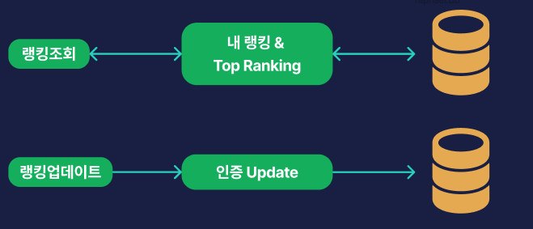

안녕하세요. 모아밤팀의 서버 개발자 박세연입니다!

랭킹 시스템을 도입했던 경험을 공유하고 싶어 작성합니다.

---


## 서비스 분석

모아밤 서비스의 경우 이용자들은 매일 인증을 통해 경험치를 얻게 됩니다. 이러한 경험치를 기준으로 랭킹이 있다면, 서로 경쟁을 통해 더욱 열심히 인증을 참여할 수 있기 때문에 도입하게 되었습니다.

### 랭킹의 기준

모아밤에서 랭킹의 기준은 사용자가 인증할때 마다 쌓이는 경험치입니다.

### 랭킹에서 보여주는 데이터
랭킹에서는 현재 `사용자의 점수`, `닉네임`, `프로필 이미지`을 보여주고 있습니다.


## 모아밤 서비스의 트래픽 특성

### 랭킹 업데이트
- 매시 15분 모든 회원에 대해 업데이트를 진행

### 랭킹 조회
- 사용자의 요청이 있을 경우


위와 같은 특성을 봤을 때 대부분의 트래픽은 랭킹조회에서 발생하는 것을 알 수 있습니다.

## 설계

### 1. DB만으로 구성



사실 현재는 랭킹 자체가 지금까지 쌓아온 인증 경험치에 대해 매기고 있기 때문에 아주 단순한 구조 입니다.

따라서 위와 같이 조회할때는 단순 조회

랭킹에 대한 score를 업데이트를 할때는 update를 하면 됩니다.

만약 최근 1달간 랭킹과 같이 여러 조건이 붙는 경우네는

Ranking Board와 같은 테이블로 분리하여 테이블에서 가져올 수 있을 것입니다.

### **그렇다면 문제는?**

**1 . 매번 조회 쿼리를 날린다.**

```sql
select nickname,
       member_id,
       profile_url,
       count,
  from members
GROUP BY member_id
ORDER BY count DESC
LIMIT 10
```
위와 같이 매번 동일한 쿼리로 Grouping과 정렬하여 Top Ranking의 정보를 가져오게 됩니다.

이렇게 되면, `조회를 할 때마다 매번 테이블의 모든 데이터를 정렬`해야 합니다.

이러면 데이터가 많아지면 점점 병목현상이 심해지고, 스코어는 매번 변경이 되기 때문에 인덱스를 걸기도 힘듭니다.

**2 . 조회 쿼리를 날릴때 변경이 될 수 있다.**

데이터를 업데이트를 할 때 조회를 하게 된다면 잘못된 정보를 가져가게 된다. 물론 사용자가 재 조회할 수도 있지만, 어쨌든 문제이다. 따라서
업데이트를 할 때는 조회가 안되도록 락을 걸어야 한다.

### 2. Redis와 함께 사용
우리 서비스에서 랭킹에 대한 트래픽은 업데이트는 매 정각에서 10분 사이에 인증 경험치가 업데이트되다 보니 조회가 압도적으로 많았습니다.

따라서 이를 해결하기 위해 caching 기능을 따로 사용해야 했습니다. 
그래서 인메모리DB를 고민하였고 그 중 다양한 자료구조가 존재하고, 무엇보다 ranking system을 구축하기에 적합한 sorted set을 제공하는 redis를 사욯하고자 하였습니다.


위 구조가 변경이 된 구조 입니다.

먼저 `조회`의 경우, 2가지 정도 생각해 볼 수 있었습니다
1. redis에 보여주려는 모든 데이터를 저장하고서 전달 할 것인가.
2. redis에 id(인덱싱 되어있는)를 저장하고, 조회시 가져와서 DB에서 데이터를 가져와서 사용할 것인가 입니다.

이렇게 생각할 수 밖에 없었던 이유는 redis에 해당 정보만 사용하는 것이 아니라 여러 정보를 같이 사용합니다. 따라서 저장되는 데이터가 크면 비용적으로 문제가 발생할 수 있다고 생각했습니다.
또한, 인덱싱을 통해 데이터를 조회하기 때문에 이전 쿼리 방식보다는 낫기 때문입니다.

여기서 현재는 아직 redis에 인증 및 인가용 refreshtoken, 실시간 이벤트 발급 캐싱용 이렇게 2가지를 사용하고 있었고, db에 접근하지 않고 빠른 조회를 위해 사용하기 위해서 redis를 사용했었기 때문에 `2번`을 사용했습니다.


반대로 `업데이트`의 경우에도 2가지를 고민해 볼 수 있었습니다.
1. 인증 경험치가 업데이트 될 때 마다, redis의 데이터도 같이 업데이트 하여 실시간을 유지
2. scheduler를 통해 특정 시간에 업데이트 하도록 하기

처음에는 1번을 적용했었습니다. 더 좋은 user experience를 제공해주기 때문이었습니다.

### 인증 업데이트 마다 redis에 같이 했을 때의 문제점
"실시간을 유지하기 위해 매번 redis와 db를 접근해야 할까"에 대한 피드백을 받았습니다.

실시간 변경이 필수 기능도 아니였고, 인증 업데이트 트래픽은 인증시간인 매 정각 10분 사이에 일어나기 때문에, db 업데이트 후 트랜잭션 밖에서 redis에 데이터를 저장한다 하더라도 하더라도 매번 조회하기 때문에 인증 시간에 너무 많은 일을 하기 때문에 다른 작업에 영향이 갈 수 있다고 판단하였습니다.

따라서 매 인증이 끝나고 바로 업데이트를 할 수 있도록 인증 시간 외의 시간에 scheduler를 적용하여 업데이트를 적용하였습니다.

```
@Scheduled(cron = "0 11 * * * *")
public void updateAllRanking() {
	List<Member> members = memberSearchRepository.findAllMembers();
	List<UpdateRanking> updateRankings = members.stream()
		.map(MemberMapper::toUpdateRanking)
		.toList();

	rankingService.updateScores(updateRankings);
}
```

## 결론
결과적으로

위와 같은 구조를 구성하게 되었으며, 랭킹에 대해 트래픽이 집중된 시간을 피해 업데이트를 하고 랭킹을 빠르게 조회할 수 있습니다. 

이상으로 모아밤 서비스의 랭킹 시스템 도입기였습니다. 서비스 로직상 랭킹 로직 자체가 간단했지만 조건이 많아지게 된다면 그에 따른 변화에 대해서는 추가적으로 포스팅할 예정입니다.
