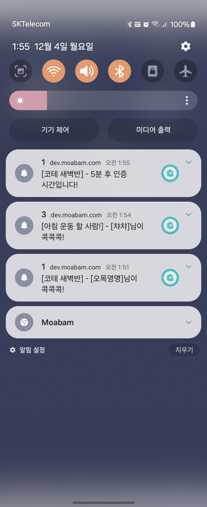
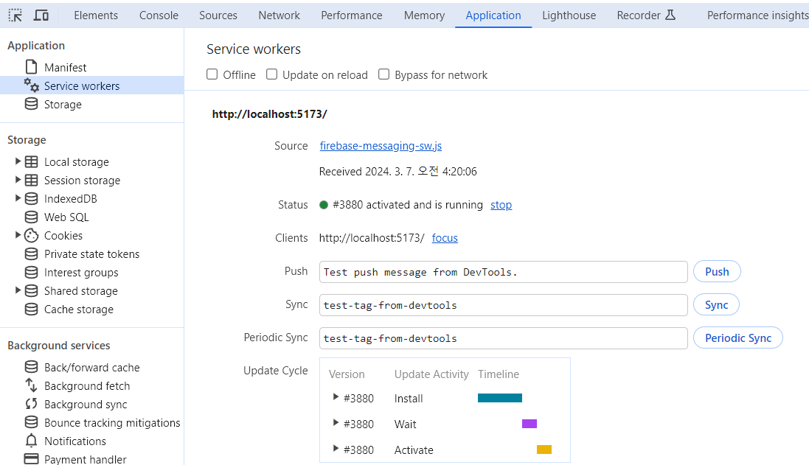
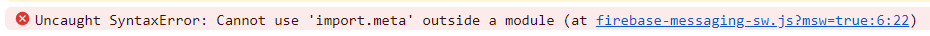
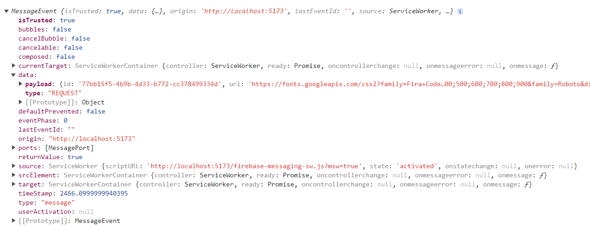

안녕하세요. 모아밤 팀의 프론트엔드 개발자 이상훈입니다.

## 서론



모아밤에서는 백그라운드 환경에서도 사용자의 지속적인 참여를 유도하기 위해 파이어베이스에서 제공하는 푸쉬 알림 서비스인 FCM을 활용했는데요.

개발하던 당시에는 아직 서비스 워커에 익숙하지 않은 상황이었기에 웹 푸쉬를 위한 서비스 워커만 실행하거나, 혹은 MSW를 위한 서비스 워커를 실행하는 등 분기 처리를 했었으나 이번에 둘을 동시에 실행할 수 있도록 리팩토링 했었던 과정을 기록해보고자 합니다.

## Web Worker

[Web Worker](https://developer.mozilla.org/ko/docs/Web/API/Web_Workers_API)는 브라우저의 메인 스레드가 아닌, 별도의 백그라운드 스레드에서 작업을 수행할 수 있는 기술입니다.

자바스크립트는 싱글 스레드로 동작하는데요. 때문에 무거운 작업을 사용자가 바라보는 화면의 처리를 담당하는 UI 스레드와 동시에 수행한다면, 사용자는 해당 작업이 수행되는 동안은 UI가 느려지거나 멈추는 경험을 하게 될 것입니다.

이런 경우에 Web Worker를 활용할 수 있습니다.

> 리액트 18 버전부터는 렌더링 과정에서 연산이 오래 걸리는 작업에 한해서 렌더링을 미루는 방식인 Concurrent Rendering 이라는 개념이 도입되기도 했습니다만, 아예 별도의 스레드로 작업을 밀어버리는 Web Worker라는 기능도 브라우저 내에서 존재합니다.

## Service Worker

Web Worker에는 일반 Worker, Shared Worker, Service Worker 등 여러 가지가 존재하는데요.

Service Worker는 Web Worker 중의 하나로, PWA 기술을 도입하는데 있어서 필수적으로 존재해야 하는 기술이기도 합니다.  
`push` 이벤트로 웹 푸쉬를 받거나, `fetch` 이벤트로 API 응답을 가로채는 등의 다양한 동작을 수행할 수 있습니다.

> 서비스 워커의 다양한 이벤트는 [MDN 문서](https://developer.mozilla.org/en-US/docs/Web/API/ServiceWorkerGlobalScope/activate_event)에서 살펴볼 수 있습니다.

Service Worker는 브라우저의 메인 스레드가 아닌 백그라운드에서 동작하기 때문에, 사용자가 서비스를 직접 이용중이지 않더라도, 심지어 브라우저를 종료했더라도 서버에서 전달받은 푸시 알림을 확인하는 등 사용자에게 지속적인 참여 유도를 할 수 있습니다.

### 등록 방법

먼저 서비스 워커 파일을 작성해야 합니다.  
아래는 임시로 작성해 본 `serviceWorker.js` 파일인데요, 서비스 워커가 설치되면 즉시 active 상태가 되도록 `skipWaiting()` 함수를 호출했고, 이후에 서비스 워커가 활성화되면 화면을 새로고침하지 않아도 즉시 서비스 워커를 적용하도록 `clients.claim()` 함수를 호출했습니다.

```tsx
self.addEventListener('install', function (e) {
  self.skipWaiting();
});

self.addEventListener('activate', function (e) {
  e.waitUntil(self.clients.claim());
});
```

이제 이렇게 작성한 서비스 워커는 `navigator.serviceWorker.register()` 로 등록할 수 있는데요.  
아래는 Vite로 구성한 리액트 앱의 `main.tsx` 파일에 작성한 내용입니다.

> 서비스 워커의 등록은 비동기적으로 처리되기 때문에, 등록이 완료되기 전까지 리액트의 렌더링을 미루도록 처리하는 것이 좋습니다.

```tsx
if ('serviceWorker' in navigator) {
  navigator.serviceWorker.register('/serviceworker.js');
}
```



등록에 성공했다면, 이렇게 크롬 개발자 도구에서도 확인할 수 있습니다.

### 제약 조건

그런데 [서비스 워커는 같은 스코프 내에서는 반드시 하나만 존재할 수 있다](https://web.dev/learn/pwa/service-workers?hl=ko)는 제약 조건이 존재하는데요. 때문에 예를 들어 `/shop` 이라는 scope를 가진 서비스 워커가 있다면, 해당 서비스의 URI Path에서 `/shop` 아래에 해당하는 서비스 워커는 중복해서 등록할 수 없다는 특징이 있습니다.

여기에서 문제가 발생했는데요. 모아밤에서는 로컬 개발 환경에서도 API를 사용할 수 있도록 MSW로 모의 환경을 구성해 놓은 상황이었습니다.

그런데 MSW는 Service Worker의 fetch 이벤트를 활용해서 일종의 프록시 동작을 수행하는 라이브러리였기 때문에, Web Push를 수신하기 위한 서비스 워커를 추가로 등록할 수 없던 문제점이 발생했습니다.

이 문제를 해결하기 위해서 리팩토링을 하는 과정에 msw 공식문서에서 제공하는 [기존 서비스 워커와의 통합](https://mswjs.io/docs/recipes/merging-service-workers) 가이드를 찾게 되어서 이를 적용해 보았습니다.

## 서비스 워커 합치기

우리가 Web Push를 수신하기 위한 서비스 워커를 작성했다면, 이 서비스 워커에 msw를 추가하도록 처리할 수 있습니다. 이는 [importScripts()](https://developer.mozilla.org/en-US/docs/Web/API/WorkerGlobalScope/importScripts) 함수를 사용하면 됩니다.

```ts
self.importScripts('/mockServiceWorker.js');

self.addEventListener('install', function (e) {
  self.skipWaiting();
});

self.addEventListener('activate', function (e) {
  e.waitUntil(self.clients.claim());
});

self.addEventListener('push', function (e) {
  const data = e.data.json();

  if (!data) {
    return;
  }

  console.log(data);
});
```

예를 들어 위와 같이 처리한다면, Web Push를 받는 서비스 워커와 기존의 msw 서비스 워커를 통합할 수 있습니다.

이제 msw의 핸들러를 서비스 워커에 등록하기 위해 [worker.start()](https://mswjs.io/docs/api/setup-worker/start) 를 실행할 때 서비스 워커의 경로를 커스텀한 파일로 지정해주면 됩니다.

```tsx
const { worker } = await import('@/core/api/mocks/browser');

return worker.start({
  serviceWorker: {
    url: workerUrl.href,
  },
});
```

## 문제 1. Service Worker에서의 env 사용



모의 환경의 사용 여부를 유연하게 다루고자 로컬 개발 서버를 실행하기 위한 커맨드를 두 가지로 나눈 상황이었는데요:

```sh
npm run dev # 개발 서버 실행
npm run dev:msw # msw 적용하고 개발 서버 실행
```

여기서 `VITE_MSW` 라는 환경 변수가 true라면, msw를 적용해야 하는 로직이 있었는데 문제는 서비스 워커에서는 env 환경 변수를 가져올 수 없다는 것이었습니다.

이 문제는 메인 스레드에서 서비스 워커를 등록할 때 쿼리 스트링을 보내서 조건부 동작을 처리할 수 있도록 했습니다.

```ts
// main.tsx
if (!('serviceWorker' in navigator)) {
  return;
}

const workerUrl = new URL('/firebase-messaging-sw.js', location.origin);
workerUrl.searchParams.set('msw', import.meta.env.VITE_MSW);

await setupFCMServiceWorker(workerUrl);
```

이제 서비스 워커에서는 쿼리 스트링을 파싱해서 처리하면 됩니다.

```ts
if (new URL(location.href).searchParams.get('msw') === 'true') {
  self.importScripts('/mockServiceWorker.js');
}

self.addEventListener('install', function (e) {
  self.skipWaiting();
});

self.addEventListener('activate', function (e) {
  e.waitUntil(self.clients.claim());
});
```

## 문제 2. 무한 새로고침 현상


Web Push를 위한 서비스 워커와, msw를 동시에 적용했더니 무한 새로고침 되는 현상이 있었는데요.  
이 문제는 살펴보니, 기존에 서비스 워커 파일에서 생성한 Notification을 사용자가 클릭하면, [postMessage()](https://developer.mozilla.org/en-US/docs/Web/API/ServiceWorker/postMessage) 함수를 통해서 방 상세 페이지 url로 이동하도록 처리하기 위해 이벤트를 등록했던 부분이 있었는데 이 부분이 문제였습니다.

msw와 통합하기 전에는 문제가 없었지만, [msw 라이브러리 내부적으로 postMessage를 사용하는 부분](https://github.com/mswjs/msw/blob/main/src/mockServiceWorker.js#L263)이 있어서 서비스 워커가 등록되자마자 계속 새로운 url로 이동하는 현상이 발생하던 것 이었습니다.

```ts
navigator.serviceWorker.onmessage = (e) => {
  const url = e.data?.url;
  location.href = url;
};
```



그래서 이 문제는 postMessage로 전송하는 메시지의 타입을 더 구체적으로 작성하는 방식으로 해결했습니다.

```ts
// 서비스 워커 파일
self.addEventListener('notificationclick', function (e) {
  const title = e.notification?.title;
  const roomId = Number(title);

  if (!isNaN(roomId)) {
    url = `/room/${roomId}`;
  }

  e.notification.close();

  e.waitUntil(
    self.clients.matchAll({ includeUncontrolled: true }).then((windowClients) => {
      if (windowClients.length > 0) {
        const client = windowClients[0];

        client.focus();
        client.postMessage({
          type: 'notification-click',
          url,
        });
      } else {
        self.clients.openWindow(url);
      }
    }),
  );
});
```

```ts
// main.tsx
navigator.serviceWorker.register(workerUrl.href).then(() => {
  navigator.serviceWorker.onmessage = (e) => {
    const type = e.data?.type;
    const url = e.data?.url;

    if (type === 'notification-click') {
      location.href = url;
    }
  };
});
```

## References

[Web Worker 간단 정리하기](https://pks2974.medium.com/web-worker-%EA%B0%84%EB%8B%A8-%EC%A0%95%EB%A6%AC%ED%95%98%EA%B8%B0-4ec90055aa4d)  
[PWA의 핵심, 서비스 워커란?](https://wonsss.github.io/PWA/service-worker/)  
[서비스 워커 (web.dev)](https://web.dev/learn/pwa/service-workers?hl=ko)
